# INFORME DE CONSULTAS AVANZADAS, PROCEDIMIENTOS ALMACENADOS Y AUDITORÍA - MYSQL

**Proyecto:** Sistema de Gestión Veterinaria "HuellaVet"  
**Autor:** Steven León Acosta  
**Asignatura:** Bases de Datos II  
**Docente:** Jaider J Quintero Mendoza   
**Motor de Base de Datos:** MySQL 8.0+

## 1. Introducción y contexto del proyecto

El presente informe documenta la fase de Consultas Avanzadas, Agrupamientos, Procedimientos Almacenados y Auditoría para la base de datos relacional del sistema HuellaVet en el motor MySQL.

El objetivo principal es demostrar el dominio de técnicas avanzadas de manipulación de datos (DML) y la implementación de lógica de negocio mediante programación en la base de datos (PL/SQL / Triggers / Stored Procedures). A lo largo de este documento se abordan requerimientos reales del dominio veterinario:

- Consultas de proyección, ordenamiento y uniones multitabla (JOIN implícitos y explícitos).
- Filtrado condicional por estados, rangos de fechas (BETWEEN) y búsqueda por patrones (LIKE / CONCAT).
- Análisis de datos con agregación (GROUP BY, SUM, AVG, COUNT) y filtros secundarios sobre métricas (HAVING).
- Resolución de lógica de conjuntos mediante subconsultas (NOT IN vs LEFT JOIN ... IS NULL).
- Encapsulamiento de lógica en procedimientos almacenados reutilizables y parametrizados.
- Implementación de un sistema de auditoría e inmutabilidad mediante triggers de base de datos sobre transacciones contables.

## 2. Evidencia de registros de las tablas creadas (Seed Data)

A continuación se presenta la verificación física de la carga inicial de datos en las tablas del esquema HuellaVet:

**Conteo de registros de la base de datos**

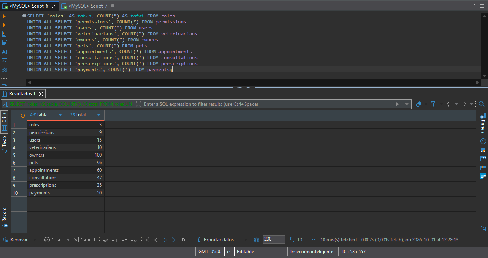

**Registros de la tabla owners**
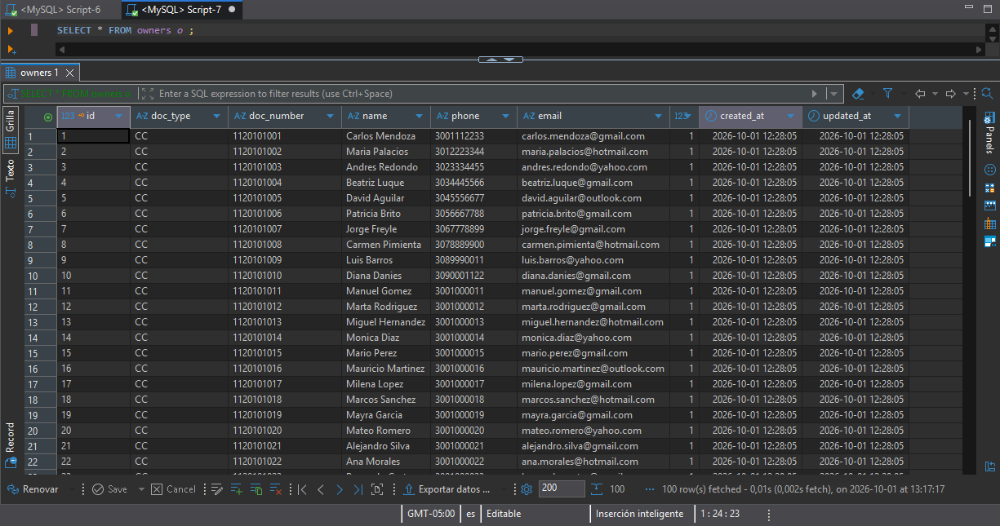


**Registros de la tabla users**

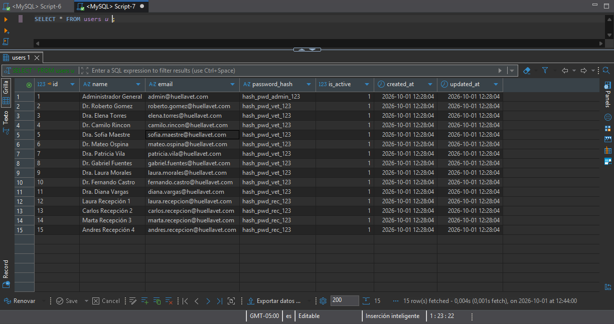

**Registros de la tabla veterinarians**

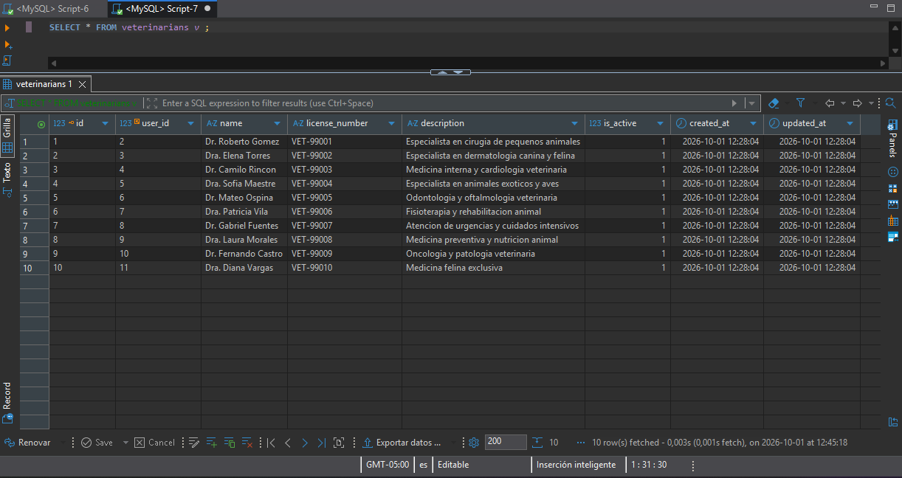

**Registros de la tabla pets**

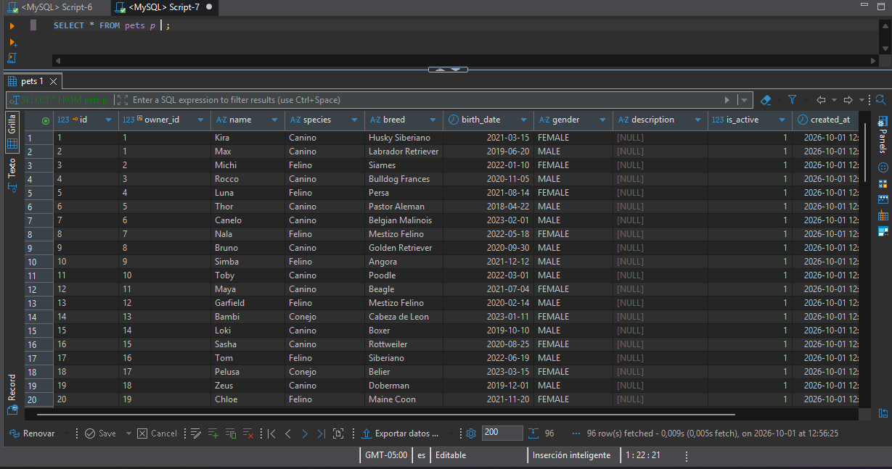

**Registros de las tablas vaccines y vaccine_batches**

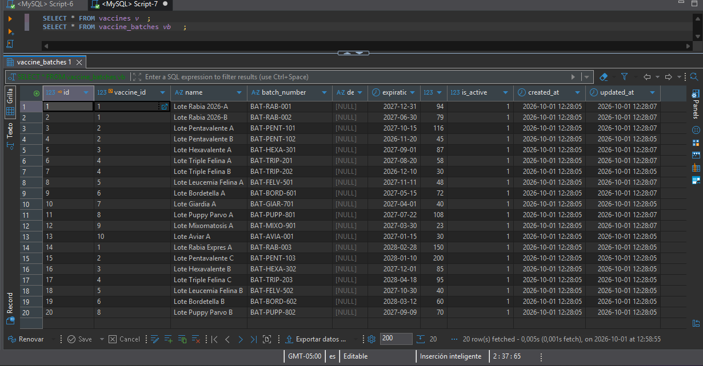

**Registros de la tabla appointments**

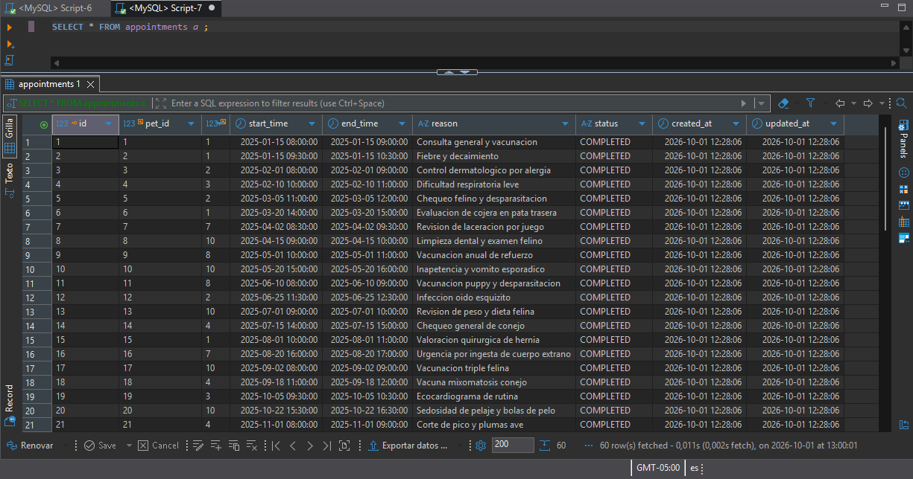

**Registros de la tabla consultations**

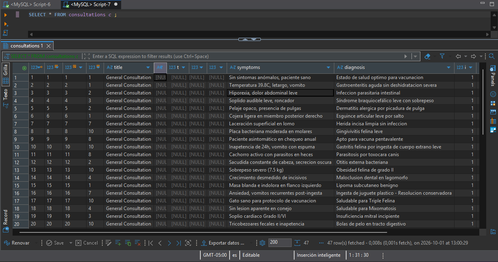

**Registros de la tabla prescriptions**

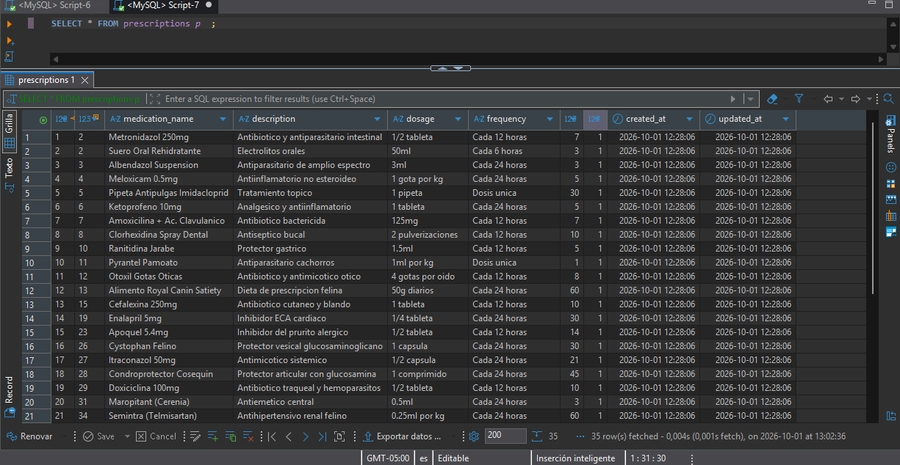

**Registros de la tabla vaccine_applications**

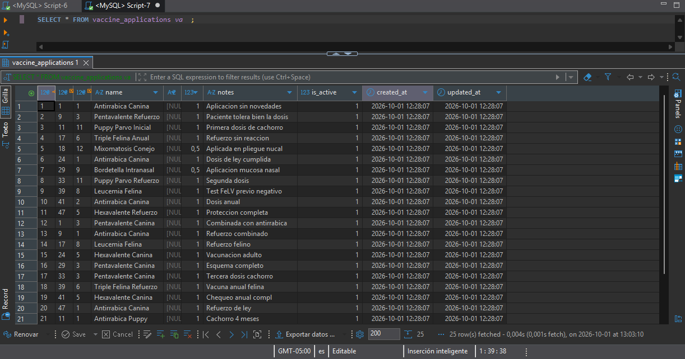

**Registros de la tabla payments**

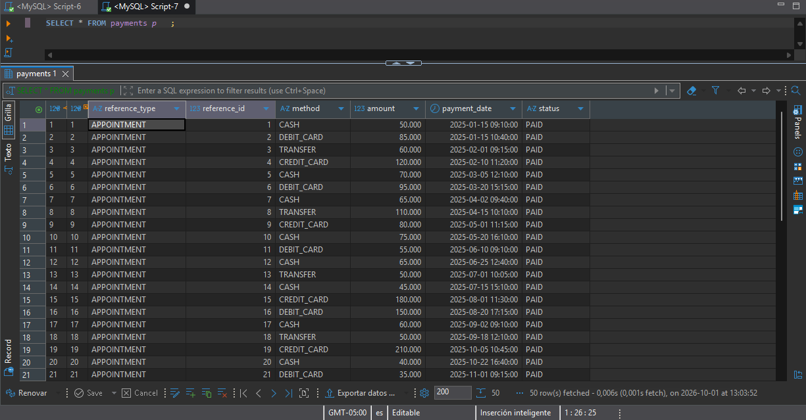

---

## 3. Consultas avanzadas en MySQL

### 3.1 Proyección básica de datos sobre propietarios (owners)

**Descripción / narrativa:**

Elegí esta consulta como punto de partida para verificar que la tabla owners se creó y pobló correctamente. En lugar de usar SELECT *, seleccioné únicamente las columnas que aportan valor real para identificar a un propietario (name, doc_type, doc_number, is_active), aplicando así la técnica de proyección de atributos para optimizar el rendimiento y evitar transferir toda la tabla por la red.

**Código SQL de la consulta:**

```sql
SELECT name, doc_type, doc_number, is_active
FROM owners;
```

**Evidencia de la ejecución del SELECT:**
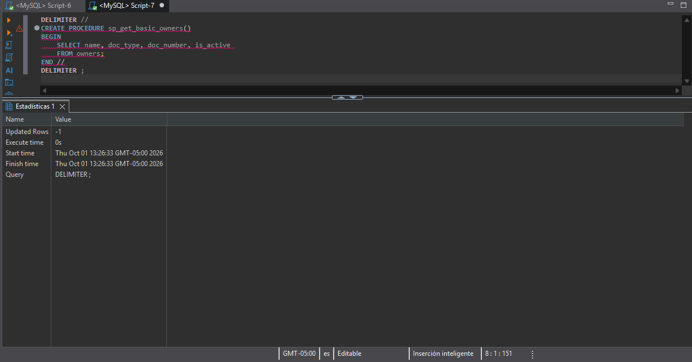

**Código SQL del procedimiento almacenado:**

```sql
DELIMITER //
CREATE PROCEDURE sp_get_basic_owners()
BEGIN
    SELECT name, doc_type, doc_number, is_active 
    FROM owners;
END //
DELIMITER ;
```

**Evidencia de la creación del procedure:**


**Código SQL para ejecutar el procedure:**

```sql
CALL sp_get_basic_owners();
```

**Evidencia de la ejecución del procedure:**
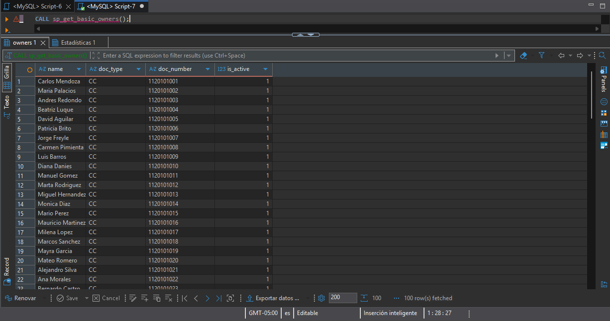
---

### 3.2 Consulta ordenada cronológicamente sobre citas (appointments)

**Descripción / narrativa:**

Elegí esta consulta para practicar la cláusula ORDER BY, esencial cuando se requiere presentar información de forma cronológica. Ordenar por start_time de forma descendente (DESC) permite al personal de recepción y consulta visualizar primero las citas médicas más recientes agendadas en la clínica.

**Código SQL de la consulta:**

```sql
SELECT id, pet_id, veterinarian_id, start_time, end_time, status
FROM appointments
ORDER BY start_time DESC;
```

**Evidencia de la ejecución del SELECT:**
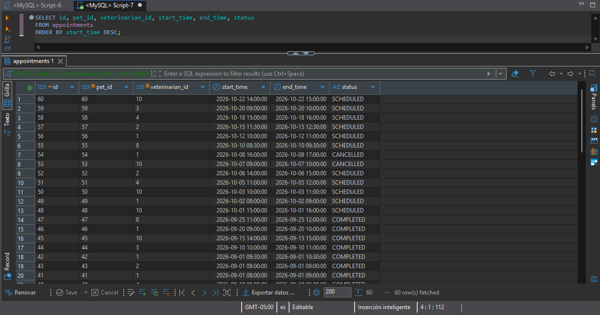

**Código SQL del procedimiento almacenado:**

```sql
DELIMITER //
CREATE PROCEDURE sp_get_appointments_desc()
BEGIN
    SELECT id, pet_id, veterinarian_id, start_time, end_time, status 
    FROM appointments 
    ORDER BY start_time DESC;
END //
DELIMITER ;
```

**Evidencia de la creación del procedure:**
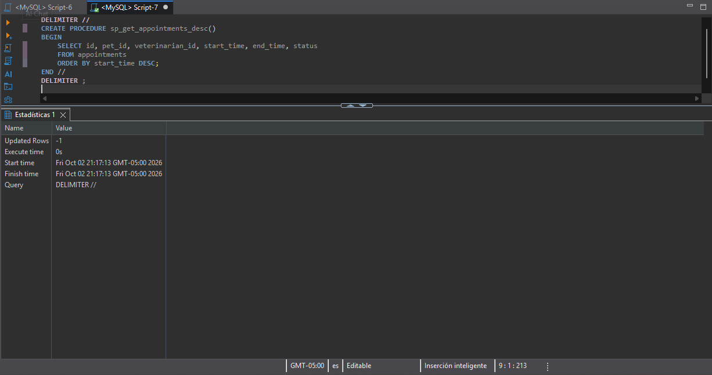
**Código SQL para ejecutar el procedure:**

```sql
CALL sp_get_appointments_desc();
```

**Evidencia de la ejecución del procedure:**
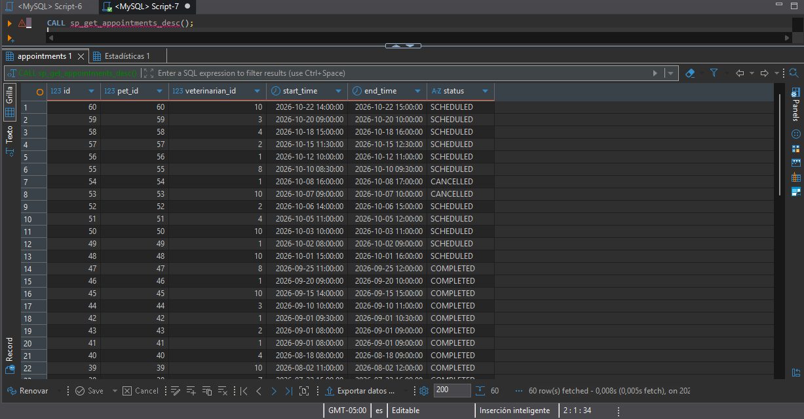
---

### 3.3 Consulta a múltiples tablas mediante WHERE implícito (owners y pets)

**Descripción / narrativa:**

Elegí esta consulta para practicar la relación entre las tablas owners y pets utilizando la sintaxis de unión implícita en la cláusula WHERE. La condición o.id = p.owner_id relaciona la clave primaria del cliente con la clave foránea de la mascota, permitiendo obtener la información completa del propietario junto con los datos de sus mascotas registradas.

**Código SQL de la consulta:**

```sql
SELECT o.name AS propietario, o.doc_number, p.name AS mascota, p.species, p.breed
FROM owners o, pets p
WHERE o.id = p.owner_id;
```

**Evidencia de la ejecución del SELECT:**
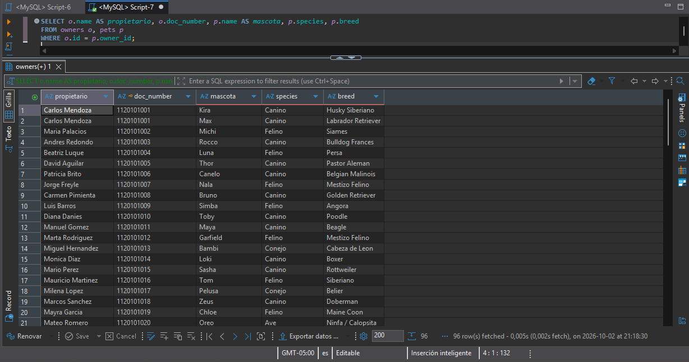
**Código SQL del procedimiento almacenado:**

```sql
DELIMITER //
CREATE PROCEDURE sp_get_owners_pets_where()
BEGIN
    SELECT o.name AS propietario, o.doc_number, p.name AS mascota, p.species, p.breed 
    FROM owners o, pets p 
    WHERE o.id = p.owner_id;
END //
DELIMITER ;
```

**Evidencia de la creación del procedure:**
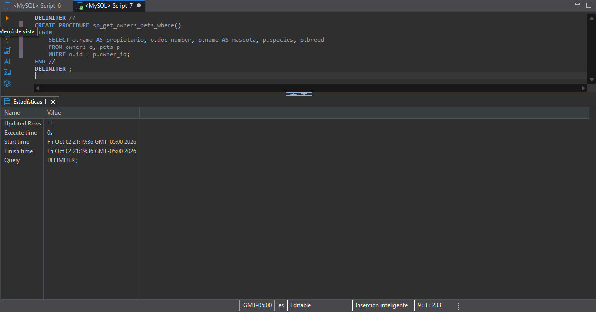
**Código SQL para ejecutar el procedure:**

```sql
CALL sp_get_owners_pets_where();
```

**Evidencia de la ejecución del procedure:**
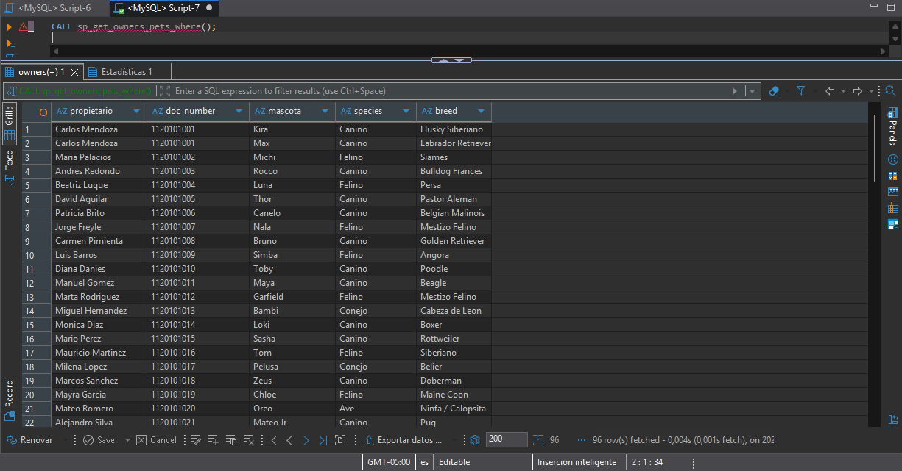
---

### 3.4 Consulta a múltiples tablas mediante JOIN explícito (owners, pets y appointments)

**Descripción / narrativa:**

Elegí esta consulta para practicar el uso explícito del estándar JOIN ... ON, el cual relaciona información de tres tablas distintas mediante sus claves foráneas. La consulta entrelaza al propietario, su mascota y las citas agendadas, mostrando una vista unificada indispensable para la atención clínica.

**Código SQL de la consulta:**

```sql
SELECT o.name AS propietario, p.name AS mascota, a.start_time, a.reason, a.status
FROM owners o
JOIN pets p ON o.id = p.owner_id
JOIN appointments a ON p.id = a.pet_id;
```

**Evidencia de la ejecución del SELECT:**
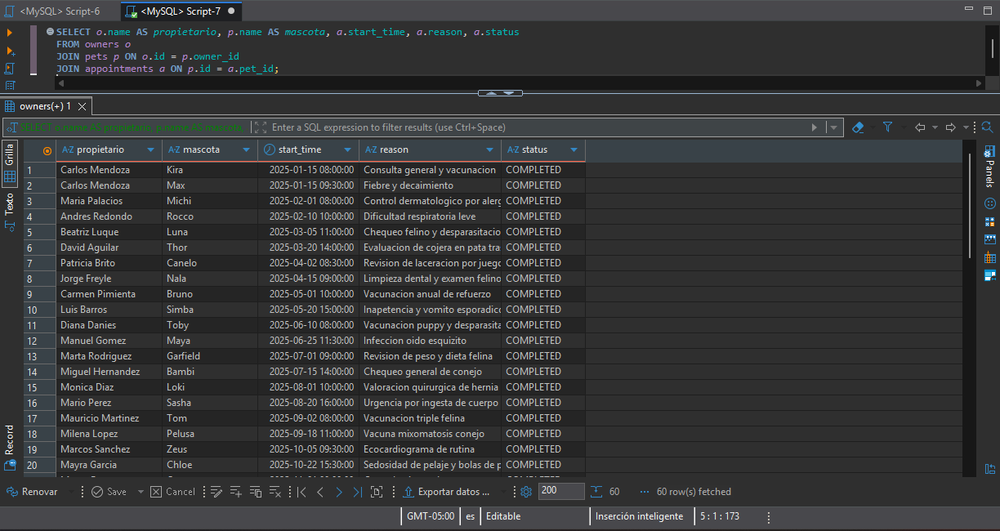
**Código SQL del procedimiento almacenado:**

```sql
DELIMITER //
CREATE PROCEDURE sp_get_appointments_full_join()
BEGIN
    SELECT o.name AS propietario, p.name AS mascota, a.start_time, a.reason, a.status
    FROM owners o
    JOIN pets p ON o.id = p.owner_id
    JOIN appointments a ON p.id = a.pet_id;
END //
DELIMITER ;
```

**Evidencia de la creación del procedure:**
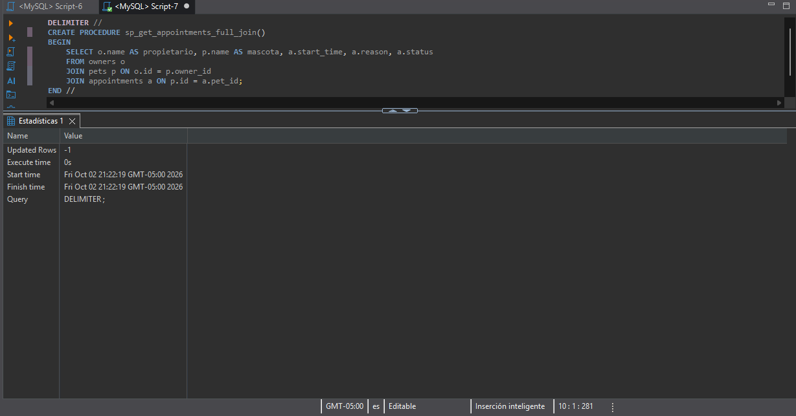
**Código SQL para ejecutar el procedure:**

```sql
CALL sp_get_appointments_full_join();
```

**Evidencia de la ejecución del procedure:**
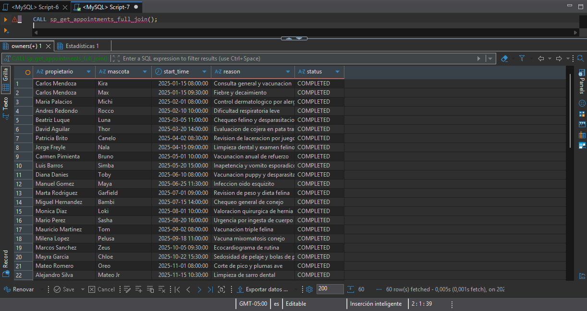
---

### 3.5 Filtros condicionales por estado de atención (status)

**Descripción / narrativa:**

Elegí estas consultas para evaluar la filtración condicional utilizando la cláusula WHERE sobre el estado de las citas. La primera consulta utiliza JOIN para obtener únicamente las citas finalizadas (COMPLETED), mientras que la segunda demuestra la misma filtración con WHERE implícito para listar las citas pendientes (SCHEDULED).

**Código SQL de la consulta - Forma 1 (con JOIN):**

```sql
SELECT o.name AS propietario, p.name AS mascota, a.start_time, a.status
FROM owners o
JOIN pets p ON o.id = p.owner_id
JOIN appointments a ON p.id = a.pet_id
WHERE a.status = 'COMPLETED';
```

**Evidencia de la ejecución del SELECT (Forma 1):**
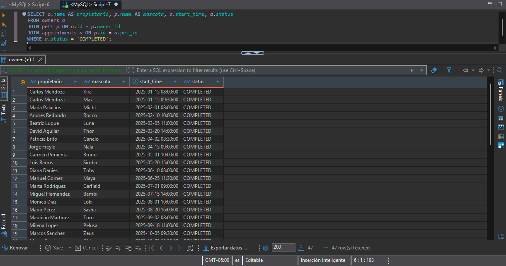

**Código SQL de la consulta - Forma 2 (con WHERE implícito):**

```sql
SELECT o.name AS propietario, p.name AS mascota, a.start_time, a.status
FROM owners o, pets p, appointments a
WHERE o.id = p.owner_id AND p.id = a.pet_id AND a.status = 'SCHEDULED';
```

**Evidencia de la ejecución del SELECT (Forma 2):**
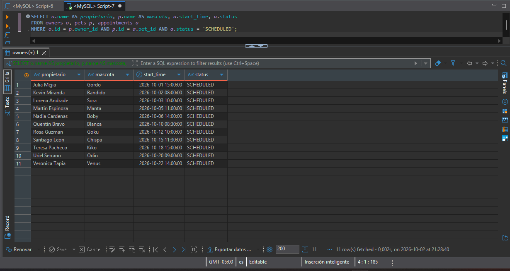
**Código SQL del procedimiento almacenado parametrizado:**

```sql
DELIMITER //
CREATE PROCEDURE sp_get_appointments_by_status(IN p_status VARCHAR(20))
BEGIN
    SELECT o.name AS propietario, p.name AS mascota, a.start_time, a.status
    FROM owners o
    JOIN pets p ON o.id = p.owner_id
    JOIN appointments a ON p.id = a.pet_id
    WHERE a.status = p_status;
END //
DELIMITER ;
```

**Evidencia de la creación del procedure:**
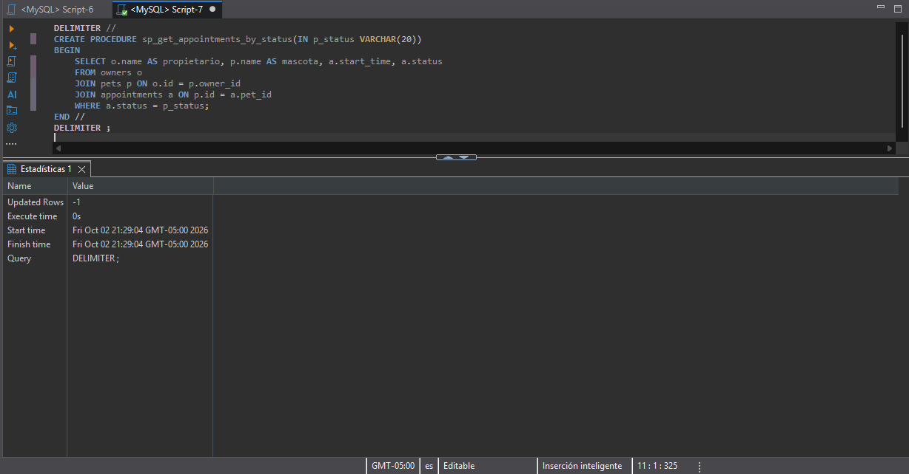
**Código SQL para ejecutar el procedure:**

```sql
CALL sp_get_appointments_by_status('COMPLETED');
```

**Evidencia de la ejecución del procedure:**
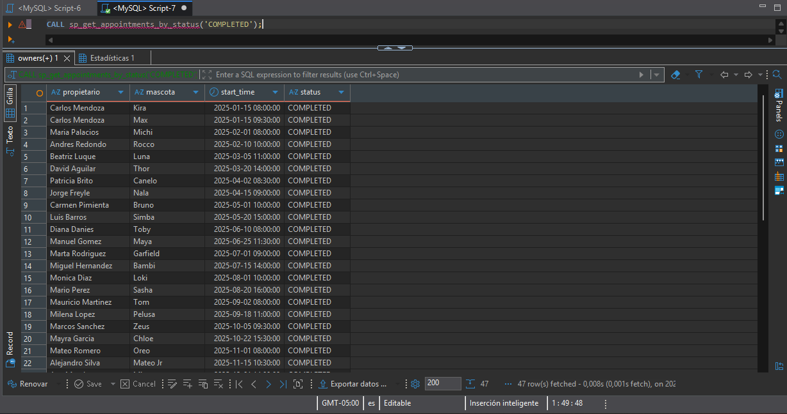
---

### 3.6 Búsqueda por patrones mediante filtros LIKE y CONCAT

**Descripción / narrativa:**

En estas consultas exploré el operador LIKE para realizar búsquedas avanzadas de texto sobre los correos electrónicos de los clientes. Probé filtrar correos por la letra inicial, la combinación con CONCAT para identificar usuarios con dominio @gmail.com, y finalmente combiné la búsqueda con el estado de la cita médica para segmentar comunicaciones.

**Código SQL de la consulta 1 (correos con inicial 'm'):**

```sql
SELECT name, email, phone
FROM owners
WHERE email LIKE 'm%';
```

**Evidencia de la ejecución del SELECT 1:**
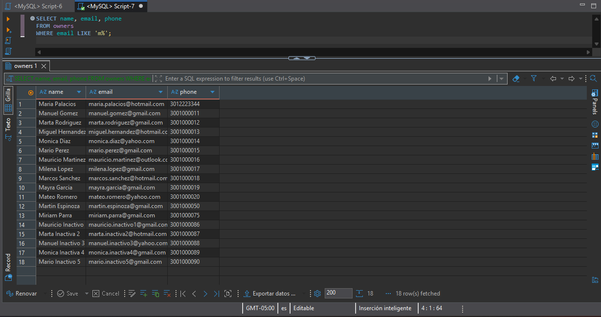
**Código SQL de la consulta 2 (dominio Gmail con CONCAT):**

```sql
SELECT name, email, phone
FROM owners
WHERE email LIKE CONCAT('%', 'gmail', '%');
```

**Evidencia de la ejecución del SELECT 2:**
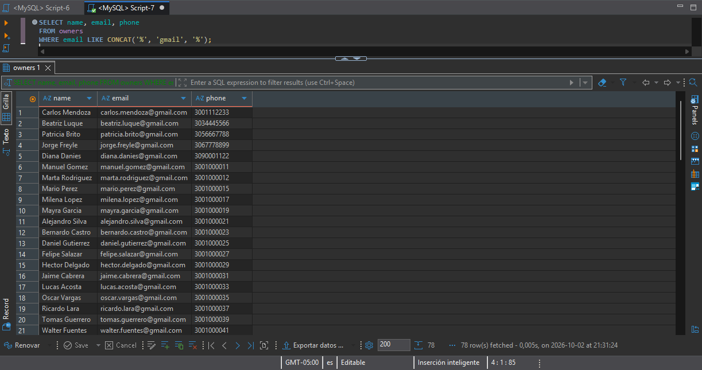
**Código SQL de la consulta 3 (combinación con estado COMPLETED):**

```sql
SELECT o.name AS propietario, o.email, p.name AS mascota, a.status
FROM owners o
JOIN pets p ON o.id = p.owner_id
JOIN appointments a ON p.id = a.pet_id
WHERE a.status = 'COMPLETED' AND o.email LIKE 'm%';
```

**Evidencia de la ejecución del SELECT 3:**
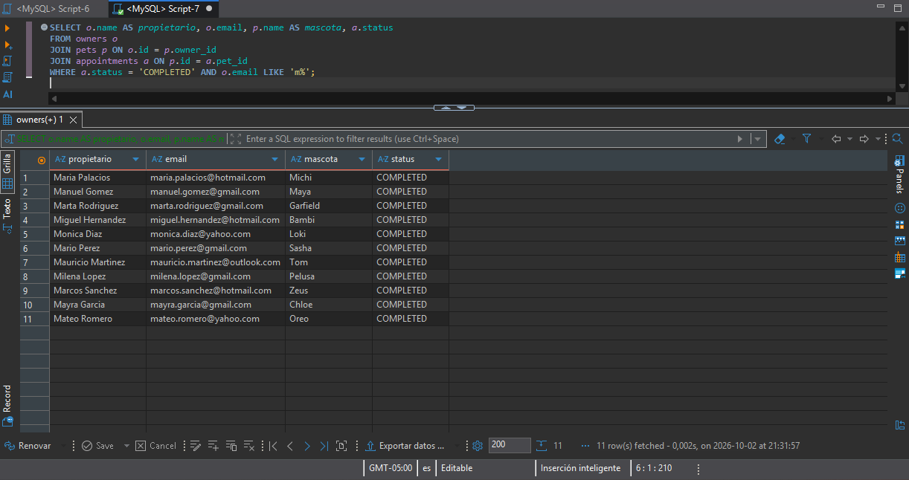
**Código SQL del procedimiento almacenado:**

```sql
DELIMITER //
CREATE PROCEDURE sp_search_owners_by_email_pattern(IN p_pattern VARCHAR(50))
BEGIN
    SELECT o.name AS propietario, o.email, p.name AS mascota, a.status
    FROM owners o
    JOIN pets p ON o.id = p.owner_id
    JOIN appointments a ON p.id = a.pet_id
    WHERE a.status = 'COMPLETED' AND o.email LIKE CONCAT('%', p_pattern, '%');
END //
DELIMITER ;
```

**Evidencia de la creación del procedure:**
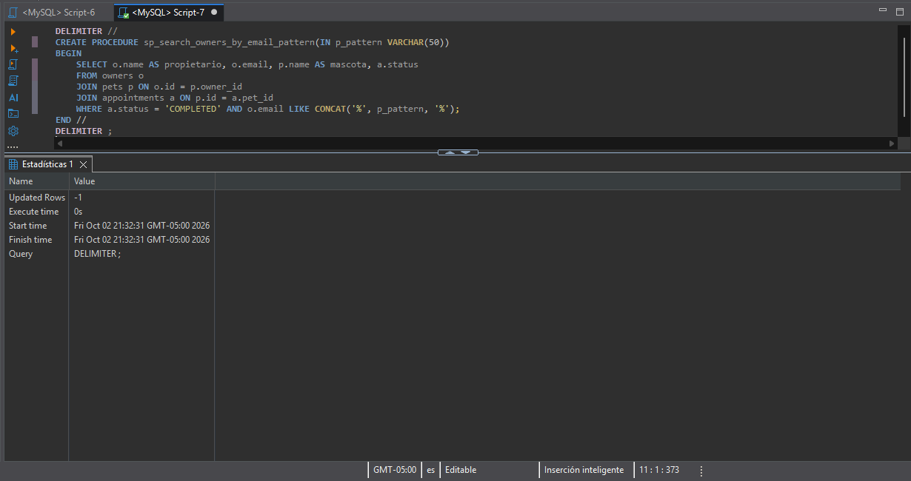
**Código SQL para ejecutar el procedure:**

```sql
CALL sp_search_owners_by_email_pattern('gmail');
```

**Evidencia de la ejecución del procedure:**
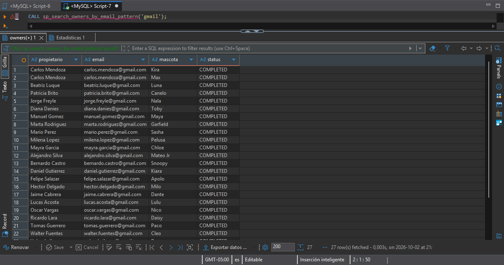
---

### 3.7 Filtros por rango de fechas mediante BETWEEN en pagos (payments)

**Descripción / narrativa:**

En esta consulta construí un reporte financiero contable restringido a una ventana temporal específica. Se integraron las tablas owners, pets, appointments y payments para rastrear los pagos recibidos entre 2025 y 2026, ordenando el resultado de forma ascendente según la fecha de transacción.

**Código SQL de la consulta - Forma 1 (con JOIN explícito):**

```sql
SELECT o.name AS propietario, p.name AS mascota, pay.amount, pay.method, pay.payment_date
FROM owners o
JOIN pets p ON o.id = p.owner_id
JOIN appointments a ON p.id = a.pet_id
JOIN payments pay ON a.id = pay.appointment_id
WHERE pay.payment_date BETWEEN '2025-01-01 00:00:00' AND '2026-12-31 23:59:59'
ORDER BY pay.payment_date ASC;
```

**Evidencia de la ejecución del SELECT (Forma 1):**
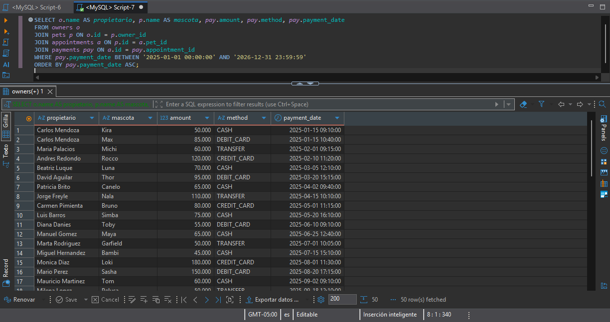
**Código SQL de la consulta - Forma 2 (con WHERE implícito):**

```sql
SELECT o.name AS propietario, p.name AS mascota, pay.amount, pay.method, pay.payment_date
FROM owners o, pets p, appointments a, payments pay
WHERE o.id = p.owner_id 
  AND p.id = a.pet_id 
  AND a.id = pay.appointment_id 
  AND pay.payment_date BETWEEN '2025-01-01 00:00:00' AND '2026-12-31 23:59:59'
ORDER BY pay.payment_date ASC;
```

**Evidencia de la ejecución del SELECT (Forma 2):**
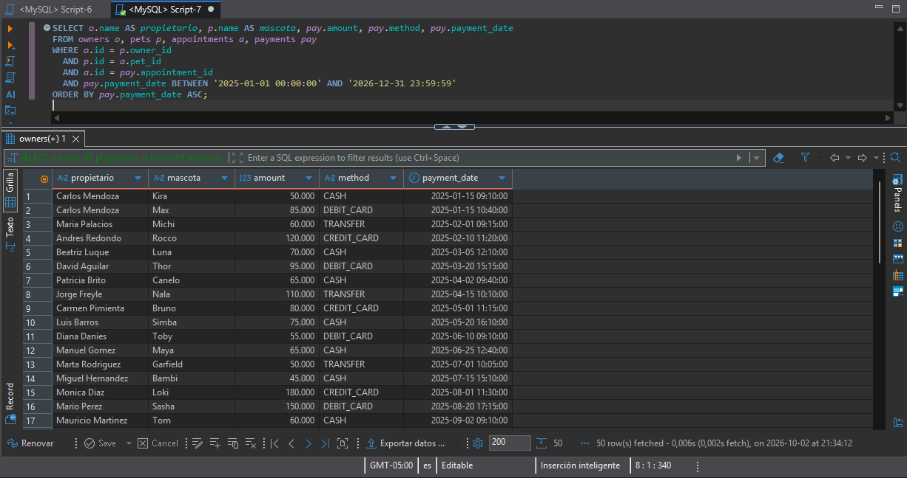
**Código SQL del procedimiento almacenado:**

```sql
DELIMITER //
CREATE PROCEDURE sp_get_payments_between_dates(IN p_start DATETIME, IN p_end DATETIME)
BEGIN
    SELECT o.name AS propietario, p.name AS mascota, pay.amount, pay.method, pay.payment_date
    FROM owners o
    JOIN pets p ON o.id = p.owner_id
    JOIN appointments a ON p.id = a.pet_id
    JOIN payments pay ON a.id = pay.appointment_id
    WHERE pay.payment_date BETWEEN p_start AND p_end
    ORDER BY pay.payment_date ASC;
END //
DELIMITER ;
```

**Evidencia de la creación del procedure:**
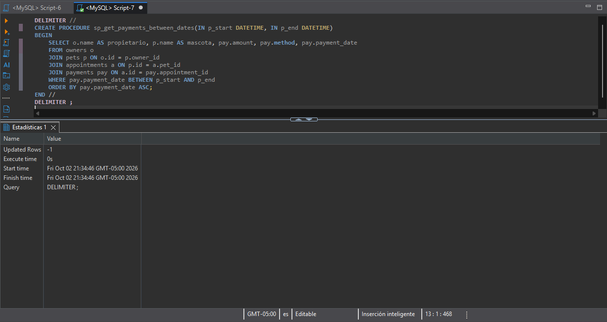
**Código SQL para ejecutar el procedure:**

```sql
CALL sp_get_payments_between_dates('2025-01-01 00:00:00', '2026-12-31 23:59:59');
```

**Evidencia de la ejecución del procedure:**
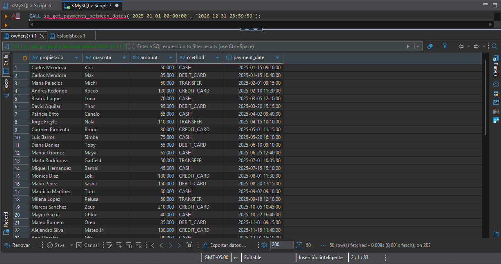
---

### 3.8 Consultas con agrupamiento GROUP BY y filtro secundario HAVING

**Descripción / narrativa:**

En este punto apliqué agregación para calcular indicadores del negocio: el monto total cobrado (SUM), el promedio por transacción (AVG) y la cantidad de pagos (COUNT). La cláusula HAVING permitió aplicar filtros condicionales sobre los datos agregados para descubrir a los clientes con mayor volumen de gasto.

**Código SQL - Forma 1 (resumen financiero por cliente):**

```sql
SELECT o.id, o.name AS propietario, 
       SUM(pay.amount) AS total_gastado, 
       COUNT(pay.id) AS cantidad_pagos, 
       AVG(pay.amount) AS promedio_pago
FROM owners o
JOIN pets p ON o.id = p.owner_id
JOIN appointments a ON p.id = a.pet_id
JOIN payments pay ON a.id = pay.appointment_id
WHERE pay.payment_date BETWEEN '2025-01-01 00:00:00' AND '2026-12-31 23:59:59'
GROUP BY o.id, o.name
ORDER BY total_gastado DESC;
```

**Evidencia de la ejecución del SELECT (Forma 1):**
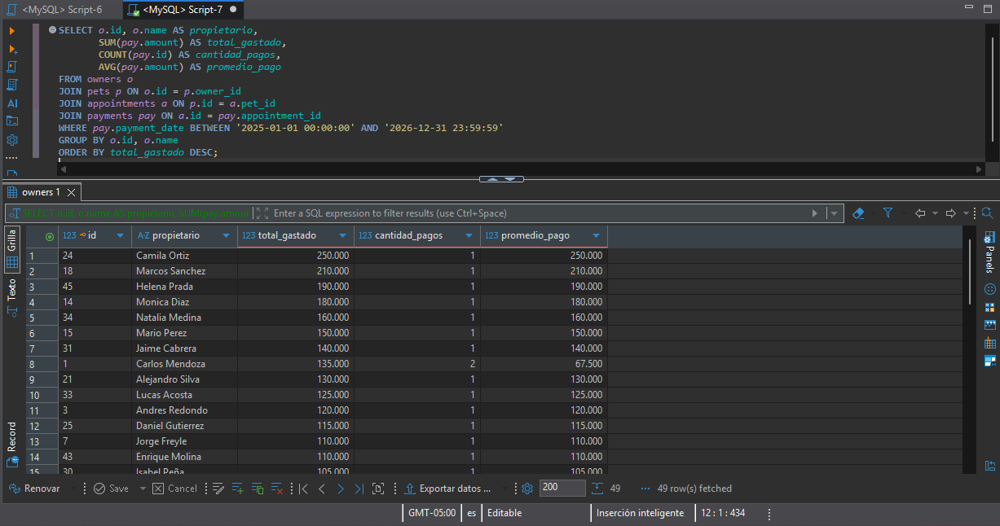
**Código SQL - Forma 2 (pagos confirmados en efectivo):**

```sql
SELECT o.id, o.name AS propietario, 
       SUM(pay.amount) AS total_gastado, 
       COUNT(pay.id) AS cantidad_pagos
FROM owners o
JOIN pets p ON o.id = p.owner_id
JOIN appointments a ON p.id = a.pet_id
JOIN payments pay ON a.id = pay.appointment_id
WHERE pay.status = 'PAID' AND pay.method = 'CASH'
GROUP BY o.id, o.name
ORDER BY total_gastado DESC;
```

**Evidencia de la ejecución del SELECT (Forma 2):**
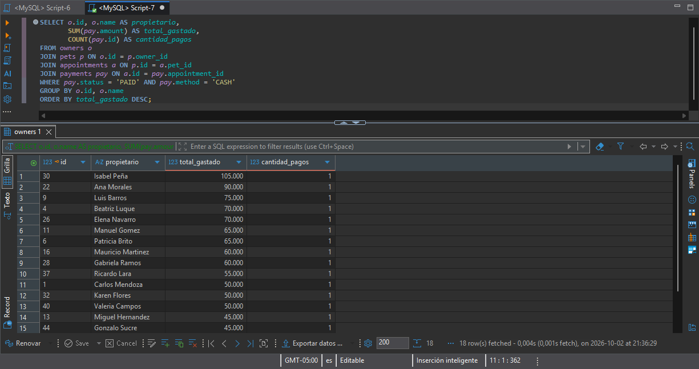
**Código SQL - Forma 3 (filtro HAVING por total abonado >= $50,000):**

```sql
SELECT o.id, o.name AS propietario, 
       SUM(pay.amount) AS total_suma, 
       AVG(pay.amount) AS promedio_pago
FROM owners o
JOIN pets p ON o.id = p.owner_id
JOIN appointments a ON p.id = a.pet_id
JOIN payments pay ON a.id = pay.appointment_id
GROUP BY o.id, o.name 
HAVING SUM(pay.amount) >= 50000
ORDER BY total_suma DESC;
```

**Evidencia de la ejecución del SELECT (Forma 3):**
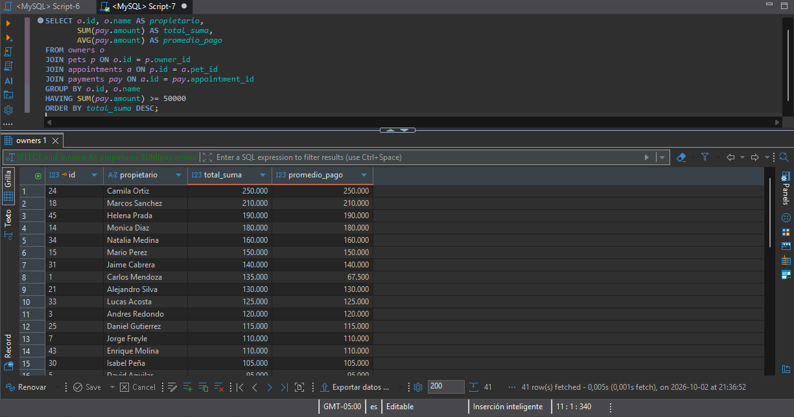
**Código SQL - Forma 4 (filtro HAVING combinado por cantidad y monto):**

```sql
SELECT o.id, o.name AS propietario, o.email,
       SUM(pay.amount) AS total_anual,
       COUNT(pay.id) AS total_pagos
FROM owners o
JOIN pets p ON o.id = p.owner_id
JOIN appointments a ON p.id = a.pet_id
JOIN payments pay ON a.id = pay.appointment_id
WHERE pay.payment_date BETWEEN '2025-01-01 00:00:00' AND '2026-12-31 23:59:59'
GROUP BY o.id, o.name, o.email
HAVING COUNT(pay.id) >= 1 AND SUM(pay.amount) >= 50000
ORDER BY total_anual DESC;
```

**Evidencia de la ejecución del SELECT (Forma 4):**
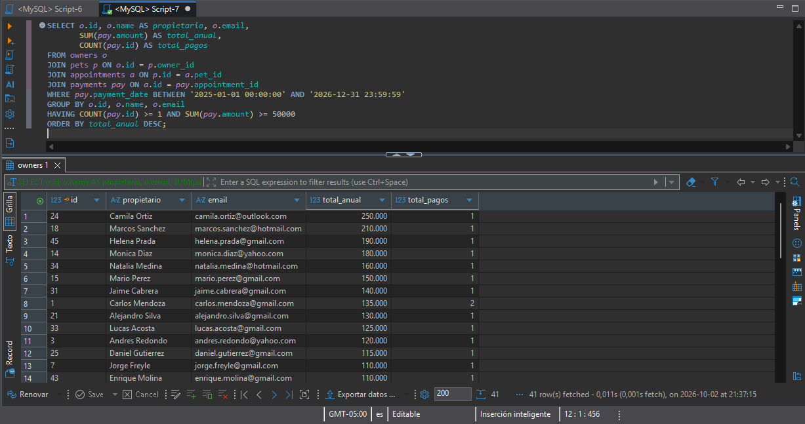
**Código SQL del procedimiento almacenado con HAVING:**

```sql
DELIMITER //
CREATE PROCEDURE sp_get_top_spending_owners(IN p_min_amount DECIMAL(10,2))
BEGIN
    SELECT o.id, o.name AS propietario, o.email,
           SUM(pay.amount) AS total_anual,
           COUNT(pay.id) AS total_pagos
    FROM owners o
    JOIN pets p ON o.id = p.owner_id
    JOIN appointments a ON p.id = a.pet_id
    JOIN payments pay ON a.id = pay.appointment_id
    GROUP BY o.id, o.name, o.email
    HAVING SUM(pay.amount) >= p_min_amount
    ORDER BY total_anual DESC;
END //
DELIMITER ;
```

**Evidencia de la creación del procedure:**
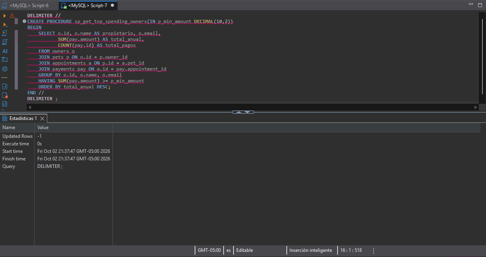
**Código SQL para ejecutar el procedure:**

```sql
CALL sp_get_top_spending_owners(50000.00);
```

**Evidencia de la ejecución del procedure:**
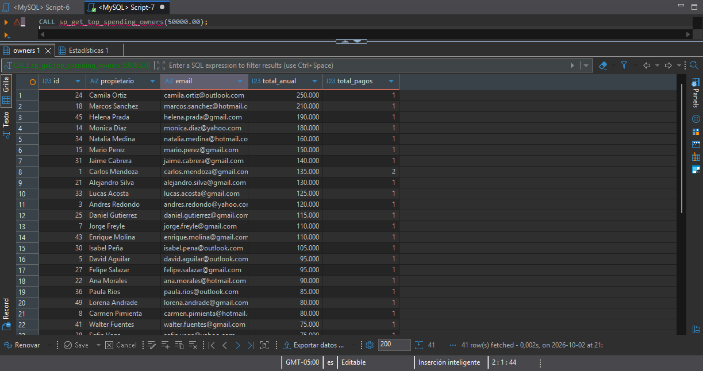
---

### 3.9 Subconsultas y teoría de conjuntos (NOT IN vs LEFT JOIN ... IS NULL)

**Descripción / narrativa:**

En esta consulta apliqué teoría de conjuntos para identificar propietarios inactivos o sin citas agendadas durante el año 2026. Comparé la técnica del NOT IN contra la estrategia de LEFT JOIN ... IS NULL, notando que esta última ofrece mayor rendimiento y legibilidad.

**Código SQL - Forma 1 (subconsulta con NOT IN):**

```sql
SELECT *
FROM owners o
WHERE o.id NOT IN (
    SELECT p.owner_id 
    FROM pets p 
    JOIN appointments a ON p.id = a.pet_id 
    WHERE a.start_time BETWEEN '2026-01-01' AND '2026-12-31'
);
```

**Evidencia de la ejecución del SELECT (Forma 1):**
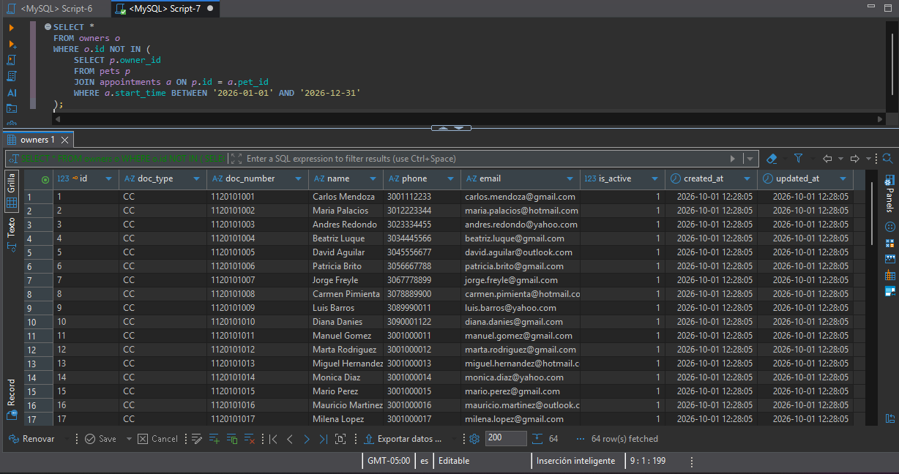
**Código SQL - Forma 2 (LEFT JOIN con condición IS NULL):**

```sql
SELECT o.*
FROM owners o
LEFT JOIN pets p ON o.id = p.owner_id
LEFT JOIN appointments a ON p.id = a.pet_id AND a.start_time BETWEEN '2026-01-01' AND '2026-12-31'
WHERE a.id IS NULL;
```

**Evidencia de la ejecución del SELECT (Forma 2):**
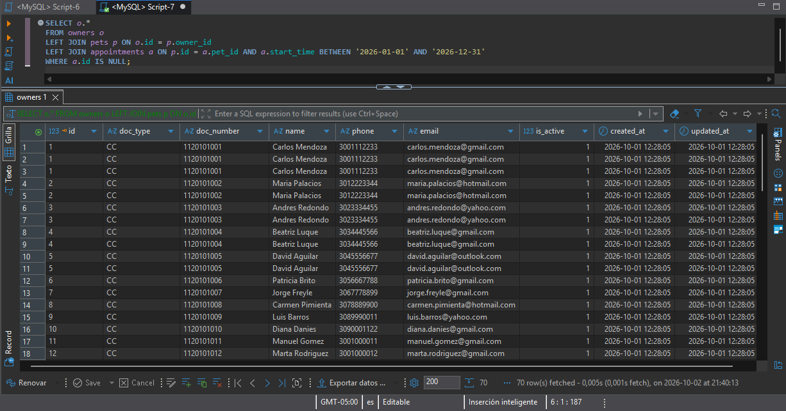
**Código SQL del procedimiento almacenado:**

```sql
DELIMITER //
CREATE PROCEDURE sp_get_owners_without_appointments()
BEGIN
    SELECT o.*
    FROM owners o
    LEFT JOIN pets p ON o.id = p.owner_id
    LEFT JOIN appointments a ON p.id = a.pet_id AND a.start_time BETWEEN '2026-01-01' AND '2026-12-31'
    WHERE a.id IS NULL;
END //
DELIMITER ;
```

**Evidencia de la creación del procedure:**
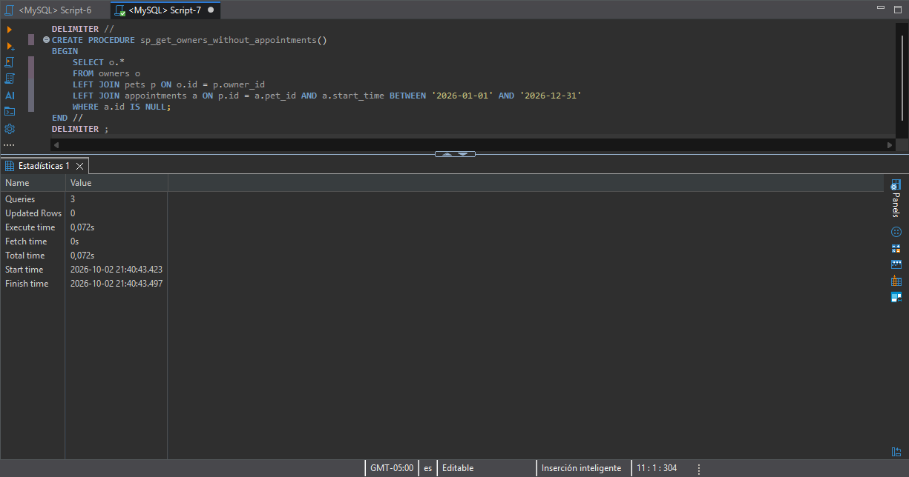
**Código SQL para ejecutar el procedure:**

```sql
CALL sp_get_owners_without_appointments();
```

**Evidencia de la ejecución del procedure:**
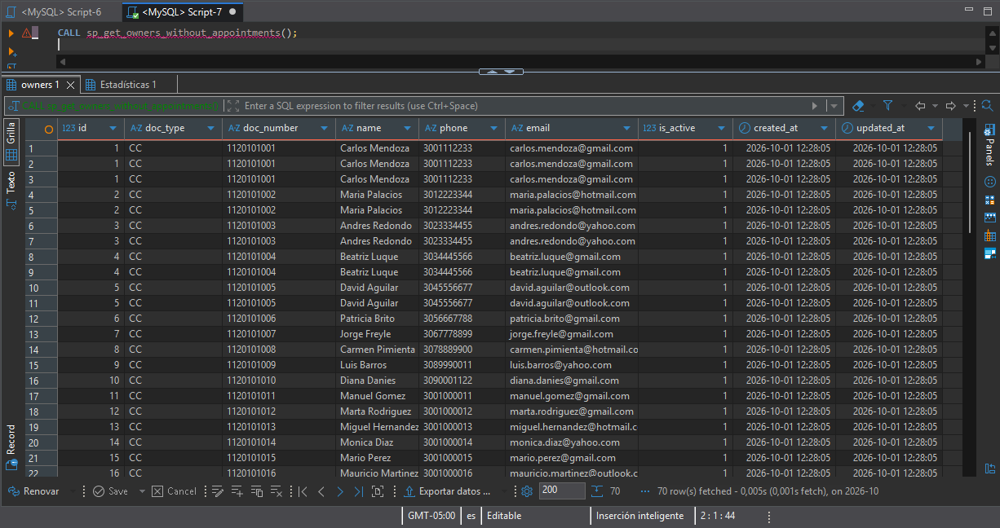
---

## 4. Sistema de auditoría e inmutabilidad con triggers en la tabla payments

### 4.1 Contexto y justificación

**Descripción / narrativa:**

Elegí la tabla payments para implementar el sistema completo de auditoría e inmutabilidad por ser la entidad más sensible ante intentos de fraude financiero. Un usuario no autorizado podría modificar montos o estados contables de forma indebida.

Para solucionar esto, se diseñó la tabla payments_audit y un conjunto de disparadores (TRIGGERS) que capturan automáticamente el estado anterior (before_data) y posterior (after_data) en formato JSON ante cualquier operación DML (INSERT, UPDATE, DELETE). Adicionalmente, se configuraron triggers que bloquean modificaciones o eliminaciones directas sobre la tabla de auditoría, garantizando su inmutabilidad absoluta.

### 4.2 Creación de la tabla de auditoría

**Código SQL:**

```sql
CREATE TABLE IF NOT EXISTS payments_audit (
  id BIGINT UNSIGNED AUTO_INCREMENT PRIMARY KEY,
  payment_id INT NOT NULL,
  actionSale ENUM('UPDATE','DELETE','INSERT') NOT NULL DEFAULT 'INSERT',
  changed_at DATETIME NOT NULL DEFAULT CURRENT_TIMESTAMP,
  changed_by VARCHAR(255) NOT NULL DEFAULT 'Admin',
  before_data JSON NULL,
  after_data JSON NULL
) ENGINE=InnoDB;
```

**Evidencia de la creación de la tabla de auditoría:**
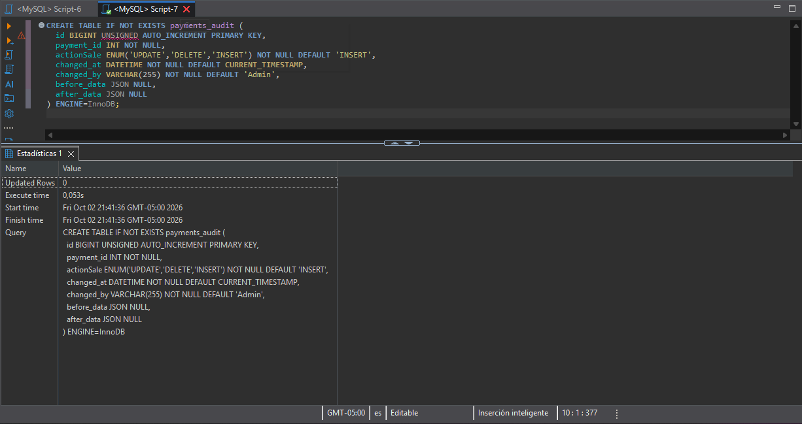
### 4.3 Trigger después de insertar (AFTER INSERT)

**Código SQL:**

```sql
DELIMITER //
CREATE TRIGGER ai_payments_audit
AFTER INSERT ON payments
FOR EACH ROW
BEGIN
  SET @from_payments_trigger = 1;
  INSERT INTO payments_audit (payment_id, actionSale, before_data, after_data)
  VALUES (
    NEW.id, 'INSERT', NULL,
    JSON_OBJECT(
      'id', NEW.id,
      'appointment_id', NEW.appointment_id,
      'method', NEW.method,
      'amount', NEW.amount,
      'payment_date', NEW.payment_date,
      'status', NEW.status
    )
  );
  SET @from_payments_trigger = NULL;
END //
DELIMITER ;
```

**Evidencia de la creación del trigger AFTER INSERT:**
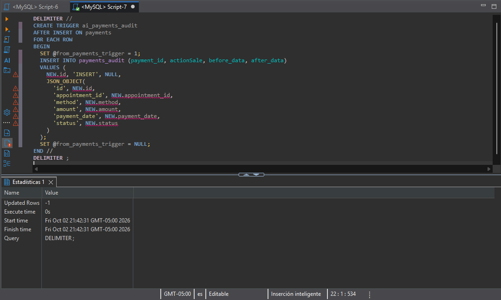
### 4.4 Trigger después de actualizar (AFTER UPDATE)

**Código SQL:**

```sql
DELIMITER //
CREATE TRIGGER au_payments_audit
AFTER UPDATE ON payments
FOR EACH ROW
BEGIN
  SET @from_payments_trigger = 1;
  INSERT INTO payments_audit (payment_id, actionSale, before_data, after_data)
  VALUES (
    NEW.id, 'UPDATE',
    JSON_OBJECT(
      'id', OLD.id,
      'appointment_id', OLD.appointment_id,
      'method', OLD.method,
      'amount', OLD.amount,
      'payment_date', OLD.payment_date,
      'status', OLD.status
    ),
    JSON_OBJECT(
      'id', NEW.id,
      'appointment_id', NEW.appointment_id,
      'method', NEW.method,
      'amount', NEW.amount,
      'payment_date', NEW.payment_date,
      'status', NEW.status
    )
  );
  SET @from_payments_trigger = NULL;
END //
DELIMITER ;
```

**Evidencia de la creación del trigger AFTER UPDATE:**
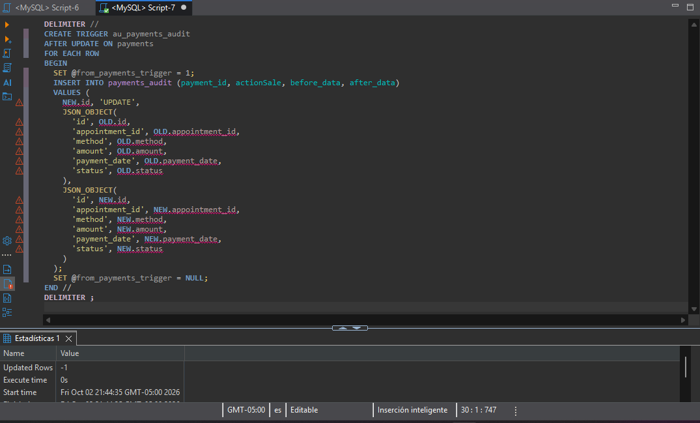
### 4.5 Trigger después de eliminar (AFTER DELETE)

**Código SQL:**

```sql
DELIMITER //
CREATE TRIGGER ad_payments_audit
AFTER DELETE ON payments
FOR EACH ROW
BEGIN
  SET @from_payments_trigger = 1;
  INSERT INTO payments_audit (payment_id, actionSale, before_data, after_data)
  VALUES (
    OLD.id, 'DELETE',
    JSON_OBJECT(
      'id', OLD.id,
      'appointment_id', OLD.appointment_id,
      'method', OLD.method,
      'amount', OLD.amount,
      'payment_date', OLD.payment_date,
      'status', OLD.status
    ),
    NULL
  );
  SET @from_payments_trigger = NULL;
END //
DELIMITER ;
```

**Evidencia de la creación del trigger AFTER DELETE:**
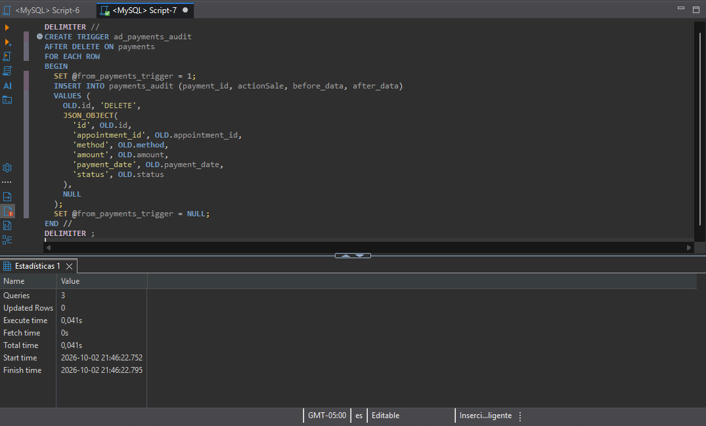
### 4.6 Trigger de bloqueo de modificación (BEFORE UPDATE)

**Código SQL:**

```sql
DELIMITER //
CREATE TRIGGER bu_payments_audit_block_update
BEFORE UPDATE ON payments_audit
FOR EACH ROW
BEGIN
  SIGNAL SQLSTATE '45000' SET MESSAGE_TEXT = 'payments_audit es inmutable: UPDATE prohibido.';
END //
DELIMITER ;
```

**Evidencia de la creación del trigger BEFORE UPDATE:**
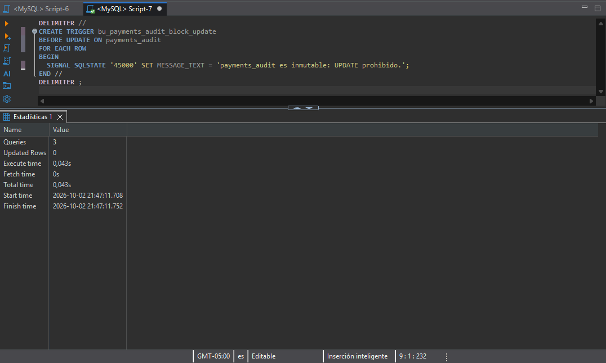
### 4.7 Trigger de bloqueo de eliminación (BEFORE DELETE)

**Código SQL:**

```sql
DELIMITER //
CREATE TRIGGER bd_payments_audit_block_delete
BEFORE DELETE ON payments_audit
FOR EACH ROW
BEGIN
  SIGNAL SQLSTATE '45000' SET MESSAGE_TEXT = 'payments_audit es inmutable: DELETE prohibido.';
END //
DELIMITER ;
```

**Evidencia de la creación del trigger BEFORE DELETE:**

### 4.8 Trigger guardián de inserción directa (BEFORE INSERT)

**Código SQL:**

```sql
DELIMITER //
CREATE TRIGGER bi_payments_audit_guard_insert
BEFORE INSERT ON payments_audit
FOR EACH ROW
BEGIN
  IF COALESCE(@from_payments_trigger, 0) <> 1 THEN
    SIGNAL SQLSTATE '45000' SET MESSAGE_TEXT = 'INSERT en payments_audit solo permitido desde triggers de payments.';
  END IF;
END //
DELIMITER ;
```

**Evidencia de la creación del trigger BEFORE INSERT:**
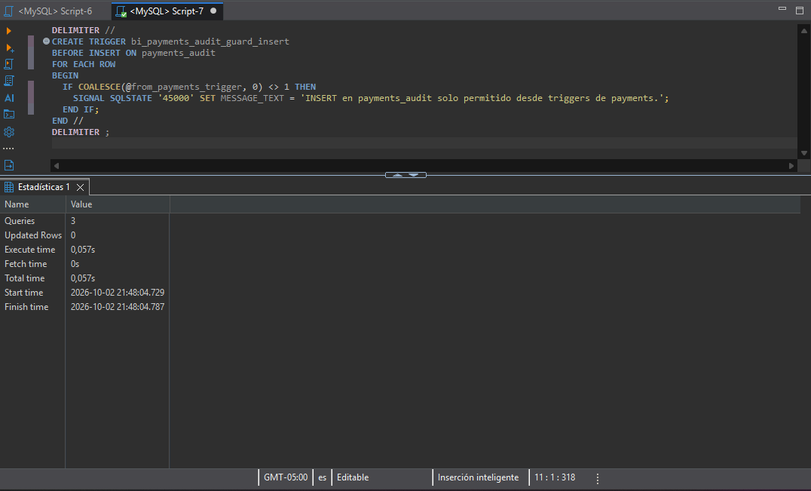
---

## 5. Evidencias de funcionalidad y pruebas de auditoría

- Evidencia de inserción registrada en auditoría
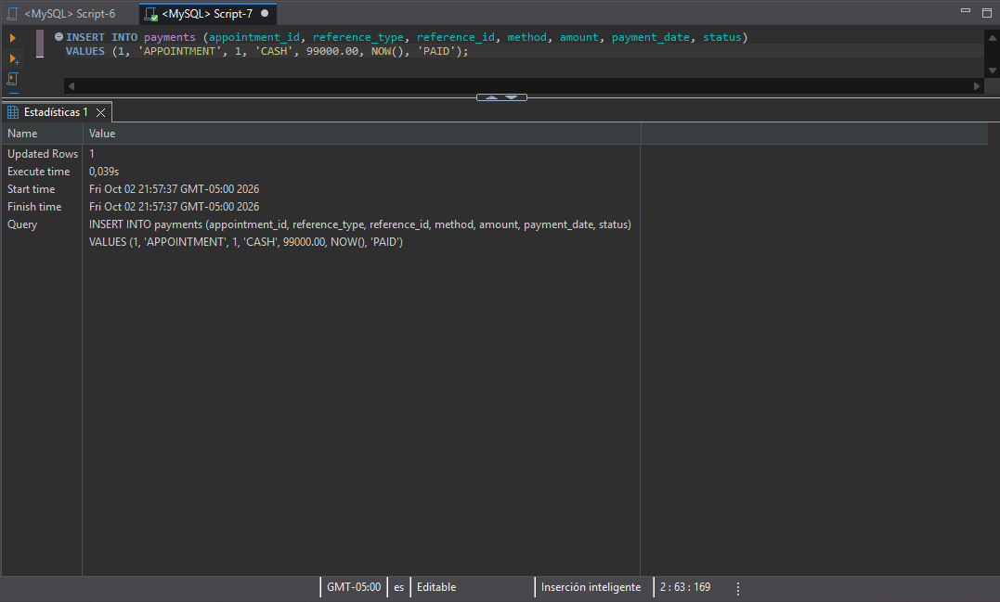
- Evidencia de actualización registrada en auditoría (before_data y after_data)
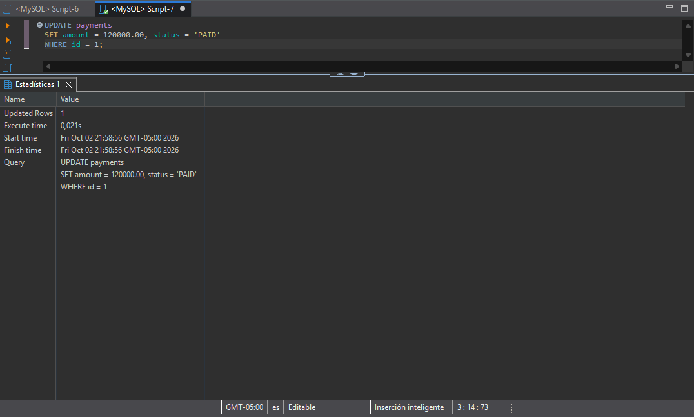
- Evidencia de eliminación registrada en auditoría
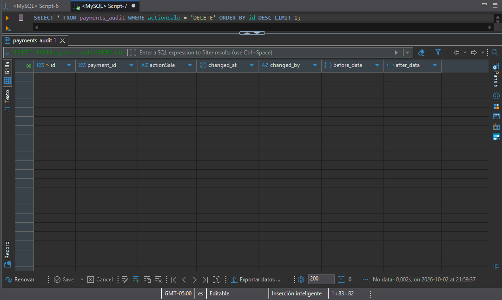
- Evidencia de bloqueo de modificación directa sobre auditoría (UPDATE rechazado)
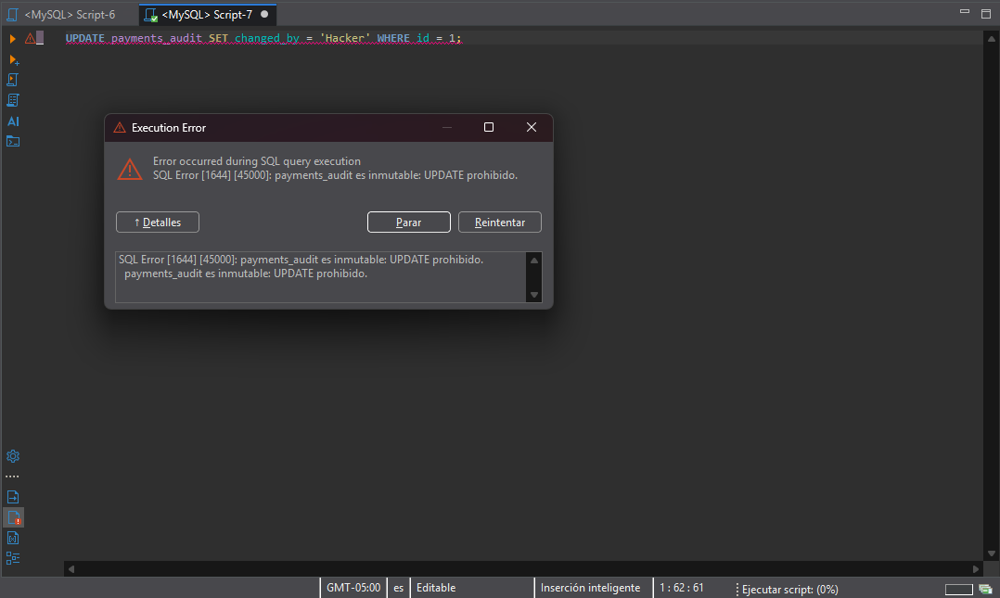
- Evidencia de bloqueo de borrado directo sobre auditoría (DELETE rechazado)
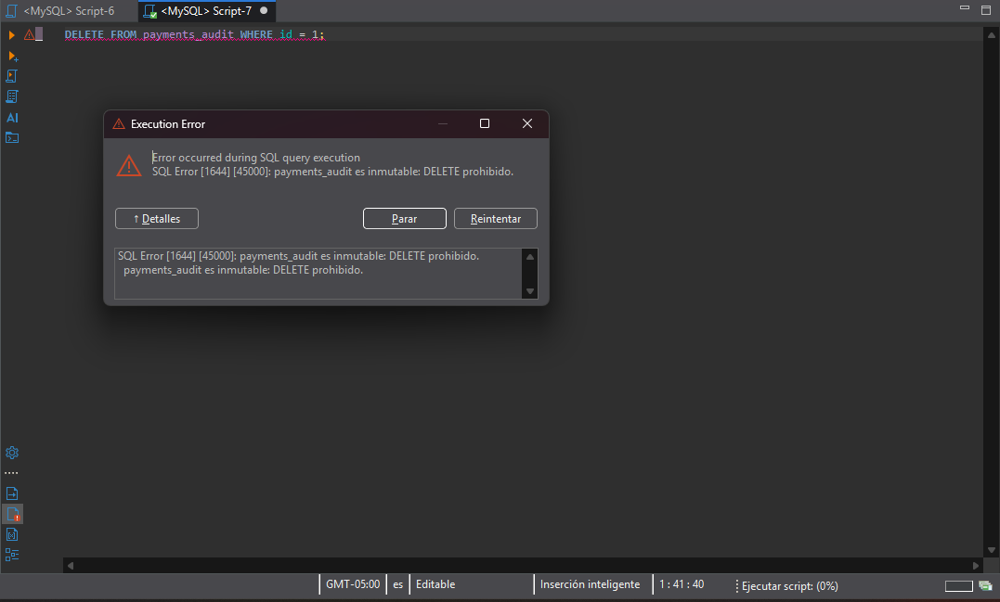
- Evidencia de bloqueo de inserción directa en auditoría (INSERT rechazado)
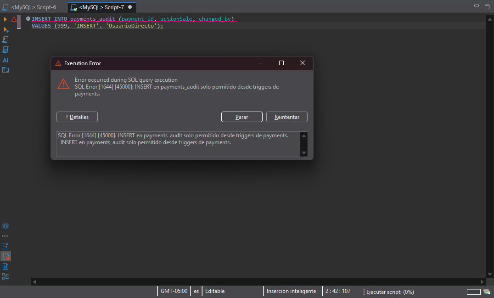
---

## 5. Evidencias de funcionalidad y pruebas de auditoría

### 5.1 Registro automático de inserción (INSERT)
Al registrar un nuevo pago en la tabla `payments`, el disparador `ai_payments_audit` captura automáticamente los datos y crea el registro en `payments_audit` guardando la estructura en `after_data`.

```sql
INSERT INTO payments (appointment_id, reference_type, reference_id, method, amount, payment_date, status)
VALUES (1, 'APPOINTMENT', 1, 'CASH', 99000.00, NOW(), 'PAID');

SELECT * FROM payments_audit ORDER BY id DESC LIMIT 1;
```
Evidencia
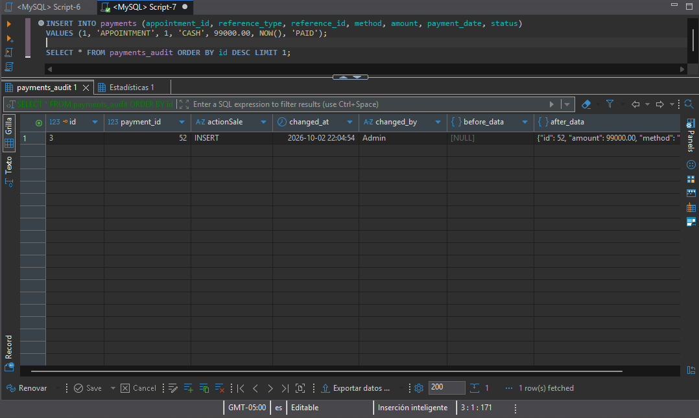

### 5.2 Registro automático de actualización (UPDATE)

Al modificar el monto o estado de un pago existente, el disparador `au_payments_audit` registra simultáneamente la fotografía anterior del registro (`before_data`) y la fotografía posterior al cambio (`after_data`).

**SQL:**

```sql
UPDATE payments 
SET amount = 120000.00 
WHERE id = 1;

SELECT * 
FROM payments_audit 
WHERE actionSale = 'UPDATE' 
ORDER BY id DESC 
LIMIT 1;
```

**Evidencia:**
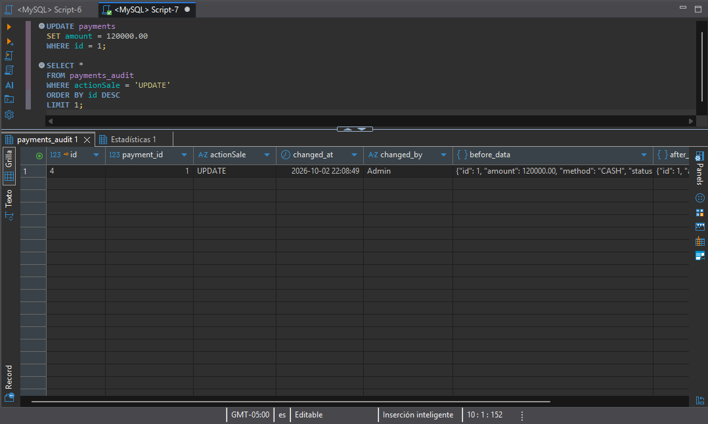

### 5.3 Registro automático de eliminación (DELETE)

Al eliminar un registro de pago, el disparador `ad_payments_audit` respalda los datos eliminados en `before_data` antes de que sean eliminados de la tabla `payments`.

**SQL:**

```sql
DELETE FROM payments 
WHERE id = 50;

SELECT * 
FROM payments_audit 
WHERE actionSale = 'DELETE' 
ORDER BY id DESC 
LIMIT 1;
```

**Evidencia:**
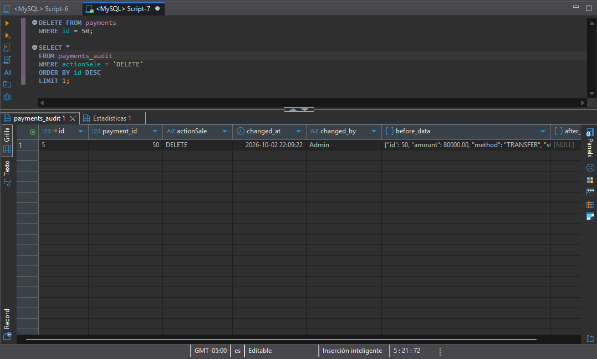

### 5.4 Prueba de inmutabilidad: Bloqueo de UPDATE directo

Cualquier intento de alterar o modificar un registro dentro de `payments_audit` es rechazado de forma estricta, generando el error `SQLSTATE '45000'`.

**SQL:**

```sql
UPDATE payments_audit 
SET changed_by = 'UsuarioNoAutorizado' 
WHERE id = 1;
```

**Evidencia:**
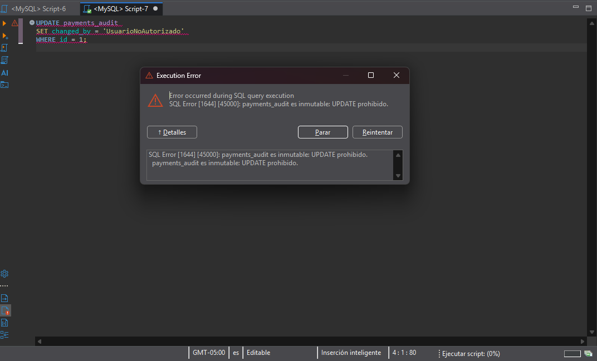
### 5.5 Prueba de inmutabilidad: Bloqueo de DELETE directo

Cualquier intento de borrar registros históricos de la tabla `payments_audit` es abortado inmediatamente por el disparador `bd_payments_audit_block_delete`.

**SQL:**

```sql
DELETE FROM payments_audit 
WHERE id = 1;
```

**Evidencia:**
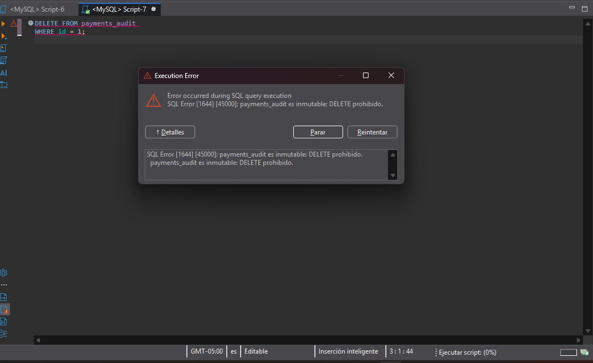
### 5.6 Prueba de inmutabilidad: Bloqueo de INSERT directo

Intentar insertar registros manualmente en `payments_audit` sin pasar por la tabla principal `payments` es bloqueado por el disparador guardián.

**SQL:**

```sql
INSERT INTO payments_audit 
(payment_id, actionSale, changed_by) 
VALUES 
(999, 'INSERT', 'Hack');
```

**Evidencia:**
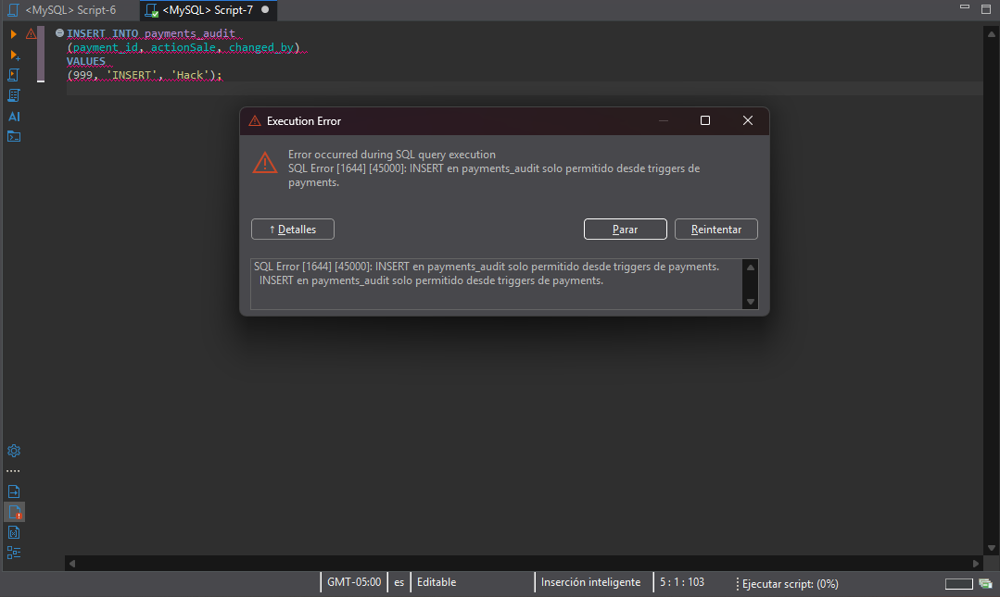

---

## 6. Conclusión general

En este informe se desarrolló y validó de forma completa la fase de Consultas Avanzadas, Agrupamientos, Procedimientos Almacenados y Auditoría para el esquema HuellaVet en MySQL.

Se demostró la paridad y potencia del lenguaje SQL mediante consultas complejas multitabla, el uso de funciones de agregación para el análisis financiero del negocio, y el encapsulamiento de procedimientos almacenados reusables. Por último, el sistema de auditoría basado en disparadores demostró proteger eficazmente la integridad contable de la clínica veterinaria mediante un registro inmutable de transacciones.
