# Informe de triggers y vista clínica de `huellavet_db`

## Resumen

Este informe organiza la evidencia de DBeaver sobre la vista `v_chronological_clinical_records` y cuatro triggers de reglas de negocio de HuellaVet. Las capturas documentan definiciones, resultados de consultas y operaciones rechazadas por los triggers.

**Estado:** hay evidencia de reglas de negocio en ejecución. La tabla `historial_cronologico` y los triggers de auditoría `INSERT`, `UPDATE` y `DELETE` presentados como propuesta aún no están demostrados por las capturas y permanecen pendientes de instalación y prueba.

## 1. Alcance y entorno

DBeaver es el cliente utilizado para consultar la conexión `HuellaVet` y la base `huellavet_db`. Las sentencias de auditoría de este documento son plantillas para MySQL 8.0; antes de ejecutarlas se debe confirmar el motor y la versión con:

```sql
SELECT DATABASE() AS base_actual, VERSION() AS version_motor;
```

Los resultados y definiciones descritos como existentes se limitan a lo visible en las capturas. No se infiere que una regla cubra operaciones que no aparecen en su definición o en una prueba.

## 2. Vista de registros clínicos

La vista `v_chronological_clinical_records` reúne información clínica y datos relacionados para consulta. La captura de sus columnas y la previsualización del SQL generado muestran estos campos:

| Campo | Contenido |
| --- | --- |
| `pet_id`, `pet_name` | Identificador y nombre de la mascota |
| `owner_name` | Nombre del propietario |
| `consultation_id`, `consultation_date` | Identificador y fecha de la consulta |
| `veterinarian_name` | Veterinario asignado |
| `symptoms`, `diagnosis` | Síntomas y diagnóstico |
| `prescribed_medications` | Medicamentos y dosis agregados para la consulta |
| `applied_vaccines` | Vacunas aplicadas y número de lote agregados para la consulta |

En la definición generada se observan relaciones entre `pets`, `owners`, `consultations` y `veterinarians`, además de uniones opcionales con `prescriptions`, `vaccine_applications` y `vaccine_batches`. `GROUP_CONCAT(DISTINCT ...)` consolida los medicamentos y las vacunas asociados.

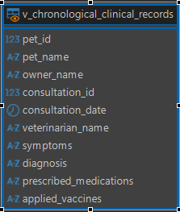

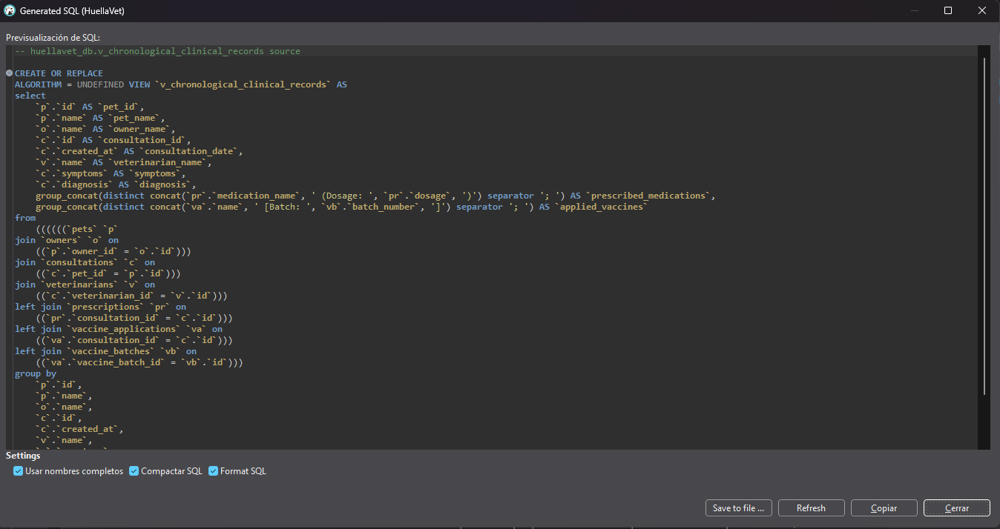

La consulta mostrada en DBeaver es:

```sql
SELECT * FROM v_chronological_clinical_records;
```

Su resultado incluye datos de mascotas, propietarios, veterinarios, síntomas y diagnósticos. La consulta no incluye `ORDER BY`; por tanto, la captura del resultado no prueba que las filas se devuelvan en orden cronológico. Para garantizar ese orden en una consulta, se recomienda especificarlo explícitamente:

```sql
SELECT *
FROM v_chronological_clinical_records
ORDER BY consultation_date, consultation_id;
```

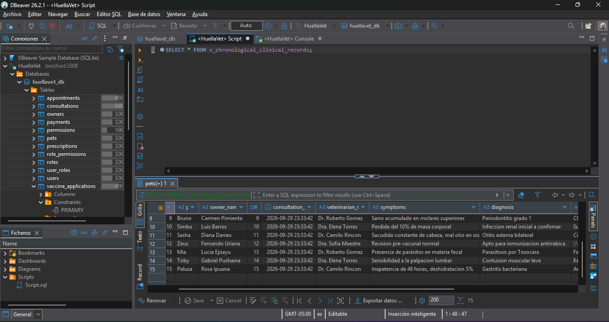

## 3. Triggers de reglas de negocio documentados

### 3.1 Descuento de inventario de vacunas

`trg_deduct_vaccine_batch_stock` se ejecuta `AFTER INSERT` sobre `vaccine_applications`. Usa `NEW.vaccine_batch_id` para ubicar el lote y resta una unidad de `stock_quantity`.

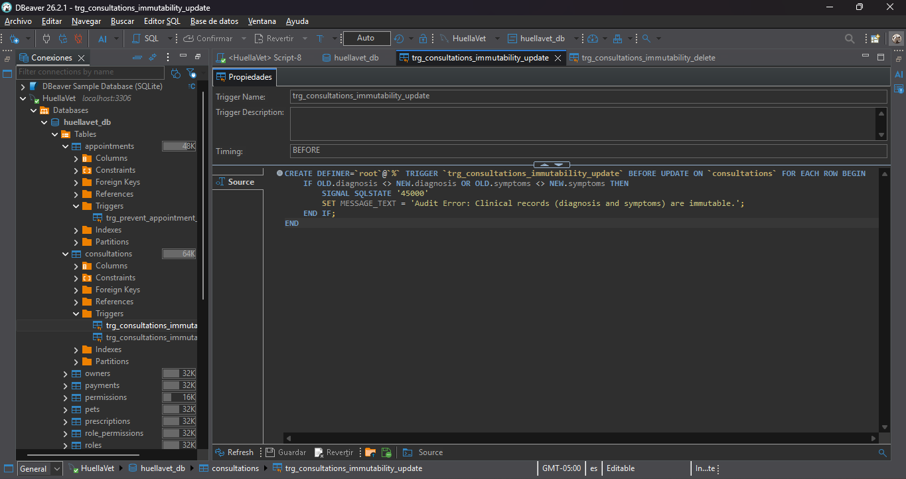

La consulta de validación muestra el lote `BAT-RAB-001` (`id = 1`) con `stock_quantity = 98`. La anotación de la captura indica un inventario inicial de 100 unidades y dos aplicaciones registradas, resultado consistente con el descuento esperado. La captura no muestra el valor inicial antes de esas operaciones.

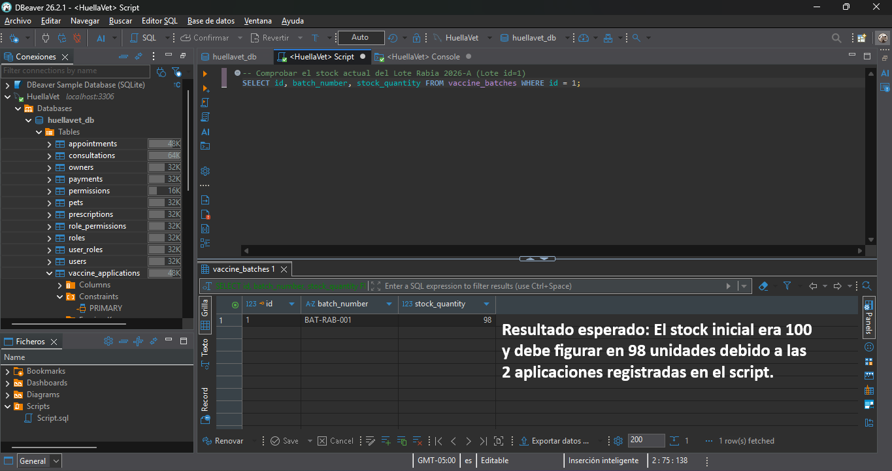

En la definición visible no se aprecia una protección que impida que el inventario llegue a valores negativos. Conviene validar stock suficiente antes de descontarlo.

### 3.2 Prevención de citas superpuestas

`trg_prevent_appointment_overlap` se ejecuta `BEFORE INSERT` sobre `appointments`. Comprueba citas no canceladas del mismo veterinario e identifica intervalos que se cruzan. Si encuentra una coincidencia, interrumpe la operación con `SQLSTATE '45000'`.

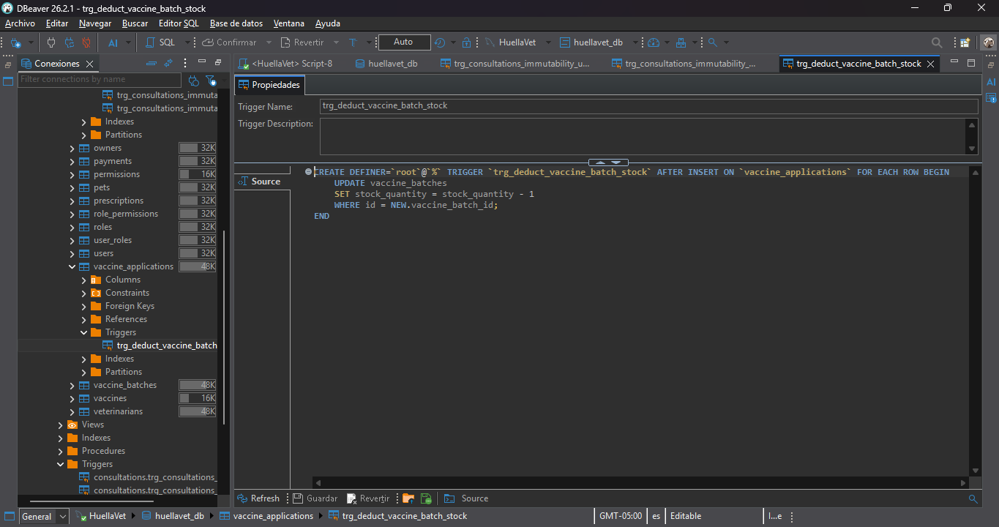

La prueba de inserción para el veterinario `id = 1` fue rechazada con el mensaje `Veterinarian already has an appointment assigned in this time range.` Esto confirma el comportamiento para el intento capturado. La definición mostrada es para `INSERT`; no demuestra que los cambios de horario mediante `UPDATE` también se validen.

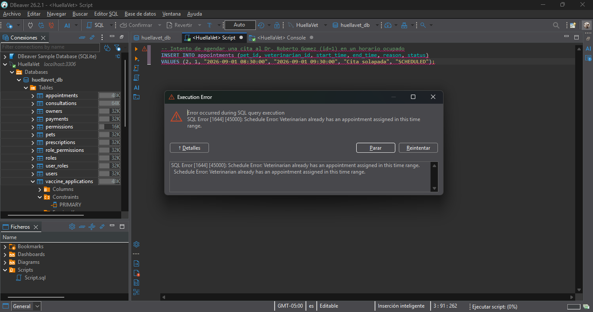

### 3.3 Inmutabilidad de datos clínicos

El trigger `trg_consultations_immutability_update` se muestra como `BEFORE UPDATE` sobre `consultations`. Si cambian `diagnosis` o `symptoms`, genera un error y cancela la actualización. La regla visible protege esos dos campos, no necesariamente todas las columnas de la consulta.

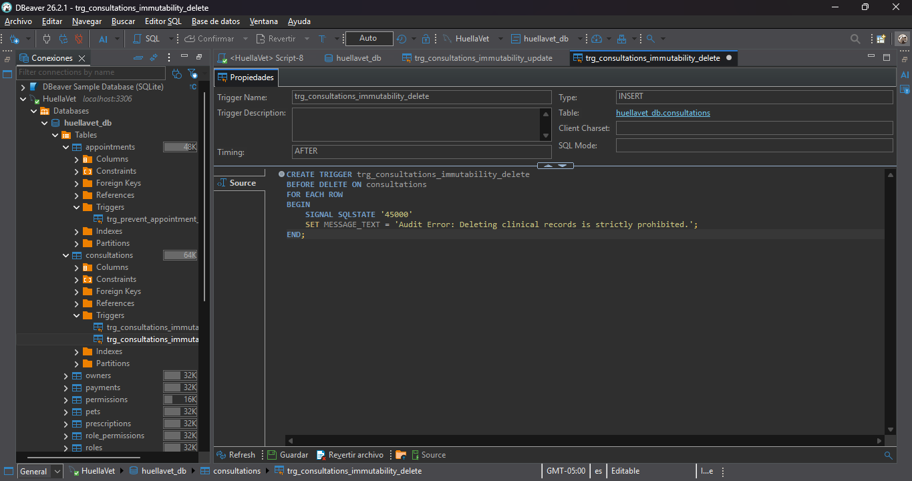

Al intentar cambiar el diagnóstico de la consulta `id = 1`, DBeaver presentó el error `1644` / `45000` con el mensaje `Clinical records (diagnosis and symptoms) are immutable.` La captura confirma el rechazo de esa operación.

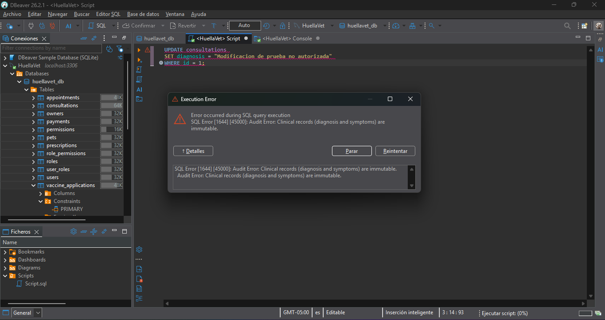

La fuente de `trg_consultations_immutability_delete` declara `BEFORE DELETE` sobre `consultations` y rechaza la operación con un error. Sin embargo, las propiedades de DBeaver muestran `Type: INSERT`, lo cual no coincide con el código fuente visible. La prueba sí muestra que `DELETE FROM consultations WHERE id = 1` fue rechazado con el mensaje `Deleting clinical records is strictly prohibited.` Para cerrar esta discrepancia, verificar la definición almacenada en el servidor.

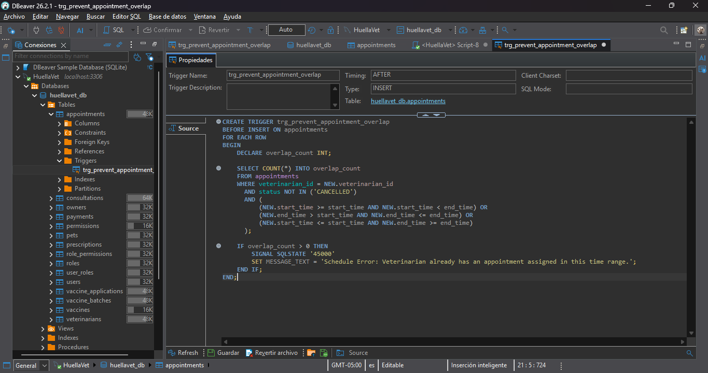

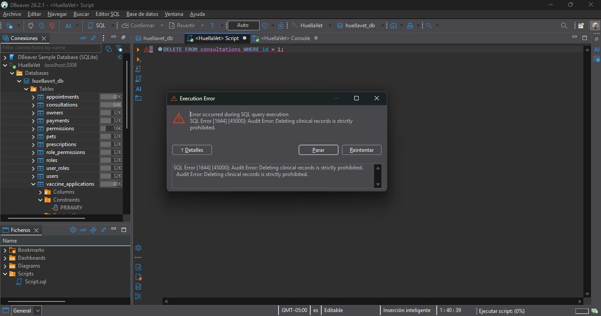

Consulta recomendada para comprobarla:

```sql
SHOW CREATE TRIGGER trg_consultations_immutability_delete;
```

### 3.4 Conteos del estado de la base

Una consulta de resumen devuelve 15 propietarios, 20 mascotas, 20 citas, 15 consultas, 15 prescripciones, 10 aplicaciones de vacunas y 15 pagos. Estos valores describen el estado visible de las tablas al momento de la captura; no prueban por sí mismos la ejecución de un trigger.

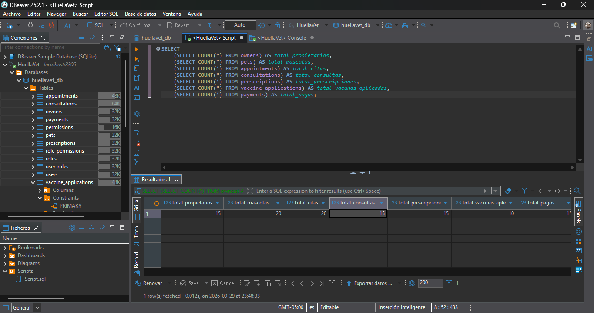

## 4. Propuesta pendiente: auditoría cronológica

La auditoría propuesta en esta sección es distinta de la vista clínica y de los cuatro triggers de negocio anteriores. Su objetivo sería registrar quién realizó `INSERT`, `UPDATE` o `DELETE`, cuándo ocurrió y los datos anteriores y nuevos. No hay evidencia en las capturas de que estos objetos ya existan.

### 4.1 Tabla de historial

No se define una llave foránea hacia la tabla auditada, para conservar los registros históricos aunque se elimine el registro original.

```sql
USE huellavet_db;

CREATE TABLE IF NOT EXISTS historial_cronologico (
	id_historial BIGINT UNSIGNED NOT NULL AUTO_INCREMENT,
	tabla_afectada VARCHAR(64) NOT NULL,
	id_registro VARCHAR(191) NOT NULL,
	operacion ENUM('INSERT', 'UPDATE', 'DELETE') NOT NULL,
	fecha_evento DATETIME(6) NOT NULL DEFAULT CURRENT_TIMESTAMP(6),
	usuario_bd VARCHAR(288) NOT NULL,
	datos_anteriores JSON NULL,
	datos_nuevos JSON NULL,
	PRIMARY KEY (id_historial),
	INDEX idx_historial_registro_fecha (tabla_afectada, id_registro, fecha_evento)
);
```

### 4.2 Plantillas de triggers

Las siguientes sentencias son ejemplos para MySQL. Antes de ejecutarlas, sustituir `NOMBRE_TABLA`, `ID_PRIMARIA`, `campo1` y `campo2` por identificadores que existan, adaptar los campos JSON y comprobar que los nombres de trigger no estén en uso.

**Inserción**

```sql
CREATE TRIGGER trg_NOMBRE_TABLA_ai
AFTER INSERT ON NOMBRE_TABLA
FOR EACH ROW
INSERT INTO historial_cronologico (
	tabla_afectada, id_registro, operacion, fecha_evento,
	usuario_bd, datos_anteriores, datos_nuevos
)
VALUES (
	'NOMBRE_TABLA', CAST(NEW.ID_PRIMARIA AS CHAR), 'INSERT', CURRENT_TIMESTAMP(6),
	CURRENT_USER(), NULL,
	JSON_OBJECT('campo1', NEW.campo1, 'campo2', NEW.campo2)
);
```

**Actualización**

```sql
CREATE TRIGGER trg_NOMBRE_TABLA_au
AFTER UPDATE ON NOMBRE_TABLA
FOR EACH ROW
INSERT INTO historial_cronologico (
	tabla_afectada, id_registro, operacion, fecha_evento,
	usuario_bd, datos_anteriores, datos_nuevos
)
VALUES (
	'NOMBRE_TABLA', CAST(NEW.ID_PRIMARIA AS CHAR), 'UPDATE', CURRENT_TIMESTAMP(6),
	CURRENT_USER(),
	JSON_OBJECT('campo1', OLD.campo1, 'campo2', OLD.campo2),
	JSON_OBJECT('campo1', NEW.campo1, 'campo2', NEW.campo2)
);
```

**Eliminación**

```sql
CREATE TRIGGER trg_NOMBRE_TABLA_ad
AFTER DELETE ON NOMBRE_TABLA
FOR EACH ROW
INSERT INTO historial_cronologico (
	tabla_afectada, id_registro, operacion, fecha_evento,
	usuario_bd, datos_anteriores, datos_nuevos
)
VALUES (
	'NOMBRE_TABLA', CAST(OLD.ID_PRIMARIA AS CHAR), 'DELETE', CURRENT_TIMESTAMP(6),
	CURRENT_USER(), JSON_OBJECT('campo1', OLD.campo1, 'campo2', OLD.campo2), NULL
);
```

En MySQL, `NEW` representa los valores nuevos y `OLD` los valores previos. `CURRENT_USER()` registra la cuenta MySQL asociada al contexto de ejecución; puede no identificar al usuario final de una aplicación.

### 4.3 Procedimiento de instalación y verificación

1. Confirmar en DBeaver que la conexión apunta a `huellavet_db` y verificar el motor con la consulta de la sección 1.
2. Identificar la tabla que se auditará y consultar su estructura con `DESCRIBE NOMBRE_TABLA;`.
3. Crear `historial_cronologico` y comprobar que aparezca en el navegador de objetos.
4. Adaptar y ejecutar cada trigger como una sentencia completa desde el editor SQL.
5. Consultar los triggers registrados con `SHOW TRIGGERS FROM huellavet_db;`.
6. En un entorno controlado, insertar, actualizar y eliminar un registro de prueba autorizado; comprobar que cada operación escriba los valores esperados.

Consulta para revisar los eventos más recientes:

```sql
SELECT id_historial, tabla_afectada, id_registro, operacion,
	   fecha_evento, usuario_bd, datos_anteriores, datos_nuevos
FROM historial_cronologico
ORDER BY fecha_evento DESC, id_historial DESC;
```

No ejecutar las plantillas sin reemplazar los marcadores. Realizar pruebas de eliminación solo con registros de laboratorio o datos respaldados. Las futuras evidencias de esta propuesta deben mostrar tanto las definiciones como las filas de auditoría generadas.

## 5. Conclusiones

Las capturas respaldan el funcionamiento observado de reglas de negocio para descuento de inventario, control de citas y protección de datos clínicos. También documentan la estructura y consulta de una vista que consolida datos clínicos, medicamentos y vacunas. Queda pendiente verificar la metadata del trigger de eliminación y, por separado, implementar y probar la auditoría cronológica propuesta; no debe presentarse como instalada hasta contar con esa evidencia.

## 6. Referencias

- TecnOgua, [Introducción y guía del estudiante para crear motores de bases de datos con Docker Compose](https://tecnogua.com/academic/site/bd/introduccion/). Fuente de apoyo para el contexto de motores y entorno; no es una referencia específica para la sintaxis de triggers.
- [Informe de historial cronológico](informe_historial_cronologico.md).
- [Informe de instalación de motores](INFORME_INSTALACION_MOTORES.md).
